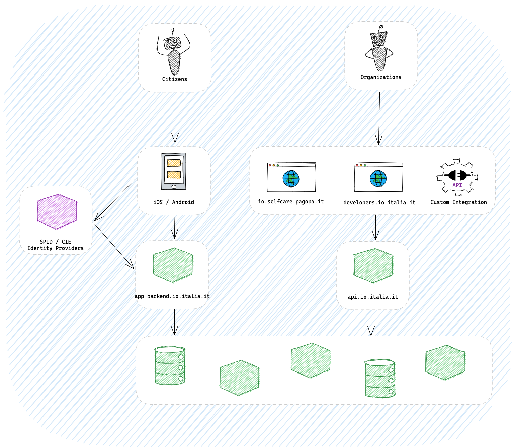

# IO
[Read in english 🇬🇧](README.en.md)

*Indice dei contenuti* <small><i><a href='http://ecotrust-canada.github.io/markdown-toc/'>generato con markdown-toc</a></i></small>
- [Descrizione del progetto](#descrizione-del-progetto)
- [Overview architetturale](#overview-architetturale)
- [Repositories](#repositories)
  * [Repositories principali](#core-repositories)
    + [App](#app)
    + [Infra](#infra)
    + [Backend](#backend)
    + [Web](#web)
    + [Utilità](#utilities)
    + [Strumenti per lo sviluppo](#developer-tool)
  * [Iniziative](#iniziative)
    + [Carta Giovani Nazionale](#carta-giovani-nazionale)
    + [Sicilia Vola](#sicilia-vola)
    + [Green Pass](#green-pass)
- [Come contribuire](#come-contribuire)
- [Licenze](#licenze)

----

## Descrizione del progetto
TBD
## Overview architetturale
`IO` è una piattaforma composta da un ecosistema di applicazioni rete.

Il _touch point_ per i Cittadini è l'**App IO**, applicazione mobile per iOS e Android, attraverso la quale essi possono accedere ai servizi offerti sulla piattaforma `IO` dagli Enti della Pubblica Amministrazione. L'identificazione dei Cittadini è delegata a _Identity Provider_ terzi quali i [provider SPID](https://www.spid.gov.it/) e l'apposito servizio [CIE](https://www.ipzs.it/ext/carta_identita_elettronica_prodotti.html) (Carta d'identità elettronica) fornito da [Istituto Poligrafico e Zecca dello Stato](https://www.ipzs.it).

Gli Enti e le Organizzazioni possono integrare i loro sistemi informativi utilizzando i portali messi a disposizione da `IO` sia le API esposte. Se sei un Ente o _Organizzazione e vuoi maggiori informazioni su come integrare i tuoi servizi su `IO`, per favore consulta il [nostro sito web](https://io.italia.it/)._

La piattaforma `IO` è progettata ispirandosi ai seguenti principi:
* _architettura a microservizi_: il sistema di compone di molteplici applicazioni di rete che collaborano alla realizzazione dei flussi di dominio;
* _everything as code_: cerchiamo di descrivere tutto tramite il codice, incluso l'infrastruttura, le logiche di code-review e le scelte di code design;
* _open by design_: il codice sorgente è pubblico e aperto così come le discussioni tecniche che si sviluppano sulle pull-request di ogni repository.

Per approfondire come questi principi vengono implementati si rimanda alle repositories relative ai singoli progetti riportate di seguito.

## Repositories
Di seguito le repositories dove trovare le implementazioni in codice delle funzionalità di `IO`.

### Repositories principali
#### App
*[io-app](https://github.com/pagopa/io-app)*  L'applicazione mobile per iOS e Android
#### Infra
*[io-infra](https://github.com/pagopa/io-infra)*  Le definizioni Terraform delle risorse cloud utilizzate da IO.

*[io-infrastructure-live-new](https://github.com/pagopa/io-infrastructure-live-new)*  

*[gitops](https://github.com/pagopa/gitops)*  Definizione delle CI/CD utilizzate dai repository IO per code-review e deploy
#### Backend
TBD

#### Web
*[io.italia.it](https://github.com/pagopa/io-infra)* Sito istituzionale del progetto, privacy policy, termini e condizioni.

#### Utilità
*[ts-commons](https://github.com/pagopa/ts-commons)*

*[pagopa-commons](https://github.com/pagopa/pagopa-commons)*

*[codegen-openapi-ts](https://github.com/pagopa/codegen-openapi-ts)*

*[io-spid-commons](https://github.com/pagopa/io-spid-commons)*

*[react-native-cie](https://github.com/pagopa/react-native-cie)*

*[react-native-zendesk](https://github.com/pagopa/react-native-zendesk)*

*[io-functions-express](https://github.com/pagopa/io-functions-express)*

*[io-functions-commons](https://github.com/pagopa/io-functions-commons)*

*[codegen-openapi-ts](https://github.com/pagopa/codegen-openapi-ts)*

#### Strumenti per lo sviluppo
TBD

### Iniziative

#### Carta Giovani Nazionale
TBD
#### Sicilia Vola
TBD
#### Green Pass
TBD

## Come contribuire
TBD

## Licenze
TBD