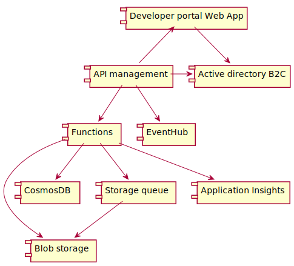

# Digital Citizenship

This is the main repository of the Digital Citizenship project, managed by
[AgID](http://agid.gov.it) and the
[Digital Transformation Team](https://teamdigitale.governo.it/en/49-content.htm).

This repository stores technical documentation and code, for a more friendly
introduction on the topic, check out the following pages (Italian):

* The
  [Digital Citizenship project page](https://teamdigitale.governo.it/it/projects/cittadinanza-digitale.htm)
  in the Digital Transformation Team site for high level introduction.
* The
  [Digital Citizenship documentation site](https://teamdigitale.github.io/digital-citizenship/)
  for more indepth explanation of the project components and goals.

## Child projects

### The Digital Citizenship APIs

* [backlog](https://www.pivotaltracker.com/n/projects/2088623)
* [API source](https://github.com/teamdigitale/io-functions)
* [docs](https://teamdigitale.github.io/digital-citizenship/)

### The Digital Citizenship mobile app

* backlog: [app](https://www.pivotaltracker.com/n/projects/2048617) and
  [app backend](https://www.pivotaltracker.com/n/projects/2116794)
* code: [app](https://github.com/teamdigitale/io-app) and
  [app backend](https://github.com/teamdigitale/io-backend)

## Contributing

### Architecture decision records

In a world of evolutionary architecture, it's important to record certain design
decisions for the benefit of future team members as well as for external
oversight. Architecture Decision Records is a technique for capturing important
architectural decisions along with their context and consequences. We store
these details in source control, along with code, as then they can provide a
record that remains in sync with the code itself.

We use
[ADR](http://thinkrelevance.com/blog/2011/11/15/documenting-architecture-decisions)s
to track architectural decisions of this initiative.

This repository is configured for Nat Pryce's
[_adr-tools_](https://github.com/npryce/adr-tools).

Here's the decisions we taken so far:

| ADR | Title                                                                                                                                             | PR (discussion)                                                      |
| --- | ------------------------------------------------------------------------------------------------------------------------------------------------- | -------------------------------------------------------------------- |
| 1   | [Record architecture decisions](architecture/decisions/0001-record-architecture-decisions.md)                                                     |                                                                      |
| 2   | [Use OpenAPI to define the API specs](architecture/decisions/0002-use-openapi-to-defined-the-api-specs.md)                                        | [PR#3](https://github.com/teamdigitale/io/pull/3)   |
| 3   | [Follow a cloud native design principle](architecture/decisions/0003-follow-a-cloud-native-design-principle.md)                                   | [PR#4](https://github.com/teamdigitale/io/pull/4)   |
| 4   | [Minimize lock-in to a particular cloud provider or feature](architecture/decisions/0004-minimize-cloud-lock-in.md)                               | [PR#5](https://github.com/teamdigitale/io/pull/5)   |
| 5   | [We chose Microsoft Azure as our primary cloud provider](architecture/decisions/0005-we-chose-our-primary-cloud-provider.md)                      | [PR#6](https://github.com/teamdigitale/io/pull/6)   |
| 6   | [Choice of primary key for citizen data](architecture/decisions/0006-choice-of-primary-key-for-citizen-data.md)                                   | [PR#9](https://github.com/teamdigitale/io/pull/9)   |
| 7   | [Choice of Azure region](architecture/decisions/0007-choice-of-azure-region.md)                                                                   | [PR#11](https://github.com/teamdigitale/io/pull/11) |
| 8   | [Choice of backend language](architecture/decisions/0008-choice-of-backend-language.md)                                                           | [PR#12](https://github.com/teamdigitale/io/pull/12) |
| 9   | [We choose a CosmosDB API](architecture/decisions/0009-we-choose-a-cosmosdb-api.md)                                                               | [PR#13](https://github.com/teamdigitale/io/pull/13) |
| 10  | [We select an Azure app hosting service](architecture/decisions/0010-we-select-an-azure-app-hosting-service.md)                                   | [PR#27](https://github.com/teamdigitale/io/pull/27) |
| 11  | [We chose a different CosmosDB API](architecture/decisions/0011-we-chose-a-different-cosmosdb-api.md)                                             | [PR#28](https://github.com/teamdigitale/io/pull/28) |
| 12  | [We chose a retry strategy in case of processing errors](architecture/decisions/0012-we-chose-a-retry-strategy.md)                                | [PR#48](https://github.com/teamdigitale/io/pull/48) |
| 13  | [We decide how to expose the app backend to the internet](architecture/decisions/0013-we-decide-how-to-expose-the-app-backend-to-the-internet.md) | [PR#52](https://github.com/teamdigitale/io/pull/52) |

### Azure infrastructure

**WARNING: the following instructions may not be up to date, please ask
a project maintainer before attempting to setup or update the
infrastructure.**

The
[infrastructure](https://github.com/teamdigitale/io/tree/master/infrastructure)
drectory contains scripts and Terraform configuration to deploy the
infrastructure on the Azure cloud.

All the infrastructure related configuration files are stored under the `infrastructure` directory.

#### Environments

For each of the two different environments (`test` or `production`)
a directory in `env` contains the relative configuration.

The configuration consists in a JSON file (`tfvars.json`) with the name of the Azure services
that need to be provisioned (ie. web applications, databases) in a specific
[resource group](https://docs.microsoft.com/en-us/azure/azure-resource-manager/resource-group-overview)
(one for each environment).

The automated setup tools (discussed below) take the value from the
`ENVIRONMENT` environment variable, that **must be set** at the beginning of the
whole procedure.

ie:

```
ENVIRONMENT=test
```

#### Prerequisites

* An active [Azure subscription](https://azure.microsoft.com/en-us/free)
* [Git](https://git-scm.com/)
* [NodeJS](https://nodejs.org/it/) >= 0.6.x
* [Terraform](https://terraform.io) >= 0.10.x
* [Yarn](https://yarnpkg.com) >= 1.0.x
* NPM packages: run `yarn install`

All binaries must be in the system path.

### First time set up an Azure Active Directory B2C tenant

#### Step 1 - Add an Azure Active Directory B2C resource

To authenticate Digital Citizenship API users (through the developer portal) we
use an
[Active Directory B2C](https://docs.microsoft.com/en-us/azure/active-directory-b2c/active-directory-b2c-overview)
(ADB2C) tenant.

As it's actually not possible to create (and manage) an ADB2C tenant
programmatically, it must be manually created. See the get started guide:

https://docs.microsoft.com/en-us/azure/active-directory-b2c/active-directory-b2c-get-started

The ADB2C tenant _must_ exists _before_ running any task illustrated below.

Once created, before going on with the installation procedure, put the tenant
name in `TF_VAR_ADB2C_TENANT_ID` environment variable:

```
ADB2C_TENANT_ID=<yourtenant>.onmicrosoft.com
```

#### Step 2 - Add custom users attributes in ADB2C

During user sign-in to the Digital Citizenship API we collect some custom
attributes relative to the user account.

Go to the ADB2C blade in the Azure portal, then select "User attributes" and add
the following custom attributes (type is always "String"):

1.  Organization
1.  Department
1.  Service

#### Step 3 - Add and configure an ADB2C Sign-in / Sign-up policy

For users to be able to sign-in and sign-up through ADB2C you need to
[create a Sign-in / Sign-up Policy](https://docs.microsoft.com/en-us/azure/active-directory-b2c/active-directory-b2c-reference-policies).

Go the Azure ADB2C blade in the Azure portal -> "Sign-up or Sign-in policies" ->
"Add".

Policy Name:

* SignUpIn

Identity Providers:

* Email signup

Sign-up attributes:

* Department
* Display Name
* Given Name
* Organization
* Service
* Surname

Application claims:

* Department
* Display Name
* Given Name
* Organization
* Service
* Surname
* Email Addresses
* Identity Provider
* User is new
* User's Object ID

Multifactor authentication:

* On

Page UI customization:

* Set up for every page the following custom page URI:\
  https://teamdigitale.github.io/digital-citizenship-onboarding/unified.html
* Save the policy
* Customize the "Multifactor authentication page"
* Open "Local account sign-up page"
  * Mark all fields as required (optional = no)
  * Reorder fields and rename labels at wish

#### Step 4 - Add the Developer Portal Applications in the Azure ADB2C tenant

Finally, you need to register (create) the Developer Portal ADB2C Applications:

[instructions on how to create an ADB2C application](https://docs.microsoft.com/en-us/azure/active-directory-b2c/active-directory-b2c-app-registration)

1.  Register an ADB2C Application `dev-portal-app`

Set the return URL of this application to:\
`https://${apim}.portal.azure-api.net/signin-aad`

(replace `${APIM}` with the value of `config.azurerm_apim` in your tfvars.json
file)

Generate an application key, then set the two environment variables:

```
TF_VAR_DEV_PORTAL_CLIENT_ID=<Application Id>
TF_VAR_DEV_PORTAL_CLIENT_SECRET=<Application Key>
```

2.  Register an ADB2C Application `dev-portal-ext`

Set the return URL of this application to:\
https://`${PORTAL}`.azurewebsites.net/auth/openid/return

(replace `${PORTAL}` with the value of `config.azurerm_app_service_portal` in
your tfvars.json file)

Generate an application key, then set the two environment variables:

```
TF_VAR_DEV_PORTAL_EXT_CLIENT_ID=<Application Id>
TF_VAR_DEV_PORTAL_EXT_CLIENT_SECRET=<Application Key>
```

#### Configuration files

* `$ENVIRONMENT/tfvars.json`: read by Terrafom and the automated tasks, contains the name of the Azure resources specific to one enviroment
* `azure.tf`: the main Terraform configuration file; it takes variables value from `tfvars.json`
* `common/tfvars.json`: read by Terraform and the automated tasks, contains values for variables common to all environments; rarely needs to be changed
* `common/config.json`: a configuration file read by the automated tasks (ignored by Terraform); rarely needs to be changed
* `apim/*`: a directory that contains the configuration of the API management resource (ie. portal templates) taken from the [embedded git repository](https://docs.microsoft.com/en-us/azure/api-management/api-management-configuration-repository-git)
* `api-policies`: API policies used by the API management

#### Shared Terraform state

The Terraform state is shared through an Azure
[storage container](https://www.terraform.io/docs/state/remote.html).

The file `infrastructure/$ENVIRONMENT/backend.tf` contains
the name of the remote file, in the Azure Blob storage,
that stores the Terraform state for each environment.

Before running any command involving Terraform you must request access to the
Azure container to the project administrators (or use your own for testing
purposes when deploying to a test resource group).

#### Steps to create and configure Azure resources

1.  Ask the Azure subscription administrator for the credentials of the
    [Active Directory Principal](https://docs.microsoft.com/en-us/azure/active-directory/develop/active-directory-application-objects)
    used to let Terraform and the automated setup tools authenticate to Azure.

Set up the following enviroment variables:

```
ARM_SUBSCRIPTION_ID=<subscription Id>
ARM_CLIENT_ID=<service principal client (app) Id>
ARM_CLIENT_SECRET=<service principal client secret (key)>
TF_VAR_ARM_CLIENT_SECRET=<same value as ARM_CLIENT_SECRET>
ARM_TENANT_ID=<Active Directory domain Id>
```

2.  Check your [enviroment configuration](#example-environment-configuration)
    then run:

```
yarn infrastructure:deploy
```

Running the above command will deploy the following services to an Azure
resource group:

* [App service plan](https://azure.microsoft.com/en-us/pricing/details/app-service/plans/)
* [Functions](https://docs.microsoft.com/en-us/azure/azure-functions/functions-overview)
  app (configured)
* [CosmosDB database](https://docs.microsoft.com/en-us/azure/cosmos-db/introduction)
  (and collections)
* [Storage account](https://docs.microsoft.com/en-us/azure/storage/common/storage-introduction)
* [Storage queues](https://azure.microsoft.com/en-us/services/storage/queues/)
  (for emails and messages)
* [Blob storage](https://docs.microsoft.com/en-us/azure/storage/blobs/storage-blobs-introduction)
* [API management](https://docs.microsoft.com/en-us/azure/api-management/api-management-key-concepts)
  (with configuration)
* [Application insights](https://azure.microsoft.com/it-it/services/application-insights/)
* [Log analytics](https://azure.microsoft.com/en-au/services/log-analytics/)
* [EventHub](https://docs.microsoft.com/en-us/azure/event-hubs/event-hubs-what-is-event-hubs)
* [Web App service](https://docs.microsoft.com/en-us/azure/app-service/app-service-web-overview)

#### Component diagram



#### [Tasks](tasks)

Some services aren't yet supported by Terraform (ie. CosmosDB database and
collections,
[Functions](https://github.com/terraform-providers/terraform-provider-azurerm/issues/131),
[API management](https://docs.microsoft.com/en-us/azure/api-management/)).

These ones are created by NodeJS scripts (`infrastructure/tasks`) that provision
the services through the
[Azure Resource Manager APIs](https://github.com/Azure/azure-sdk-for-node) and
are supposed to be run from command line using the relative npm (or yarn)
script:

| Command                      | Task                                                                                            |
| ---------------------------- | ----------------------------------------------------------------------------------------------- |
| `yarn deploy:functions:sync` | [Deploy Functions code from the GitHub repository](./infrastructure/tasks/15-functions_sync.ts) |
| `yarn resources:security:ip` | [Setup IP restrictions to access resources](./infrastructure/tasks/70-ip_security.ts)           |

### Finishing the installation

Some tasks cannot be carried out programmatically and require a manual
intervention by the Azure subscription administrator through the Azure portal
interface.

#### Activate "Managed Service Identity" for the onboarding Web App Service

To ease the onboarding of new developers (API users) we use a dedicated
[Application](https://github.com/teamdigitale/io-onboarding)
that starts some automated tasks once the user sign-in into the developer
portal.

This web application exposes an HTTP endpoint that triggers some actions on the
authenticated user's account (ie. create a subscription to use the Digital
Citizenship API). These actions are triggered when the logged-in user clicks on
a call-to-action button that redirects her browser to the exposed endpoint.

To give the needed permissions (manage API management users account) to the
onboarding Web App we use
[Managed Service Identity](https://docs.microsoft.com/en-us/azure/active-directory/msi-overview).
In this way we can manage developer portal users directly from the Web
application without hardcoding any client credential into the App Service
settings.

To activate Managed Service Identity and assign the needed role to the App
Service:

1.  Navigate to the Azure Portal App Service blade (for the Web App Service
    ${config.azurerm_app_service_portal}) -> Managed Service Identity -> Register
    with Azure Active Directory -> set the value to 'On'.

1.  Navigate to the Azure Portal API management blade -> Access Control (IAM) ->
    Add the registered Web application as a "Contributor".

1.  Restart the Web App Service.

## Example environment configuration

Make sure you have the following environment variables set up before launching
any npm task to provision Azure resources.

To do that, place a `.env` file in the root of this directory that contains the
following configuration variables (all mandatory):

```bash
# May be `test` or `production`
ENVIRONMENT=test

# Tenant name of the Active Directory B2C
# Ask the project administrator for the value of this variable
TF_VAR_ADB2C_TENANT_ID=XXXXXXXXX.onmicrosoft.com

# Azure service principal credentials (main AD tenant)
ARM_SUBSCRIPTION_ID=XXXXX-XXXX-XXXX-XXXX-dXXXXXXXXX
ARM_CLIENT_ID=XXXXXXX-XXXX-XXXX-XXX-XXXXXXXXX
ARM_CLIENT_SECRET=XXXXXXXXXXXXXXXXXXXXXXXXXXXX=
ARM_TENANT_ID=XXXXXXX-XXXXX-XXXX-XXXX-XXXXXXXXXXX

# -------- Ask the project administrator for
# -------- the values of the following credentials

# Client credentials for dev-portal ADB2C App
TF_VAR_DEV_PORTAL_CLIENT_ID=XXXXXXXX-XXXX-XXXX-XXXX-XXXXXXXX
TF_VAR_DEV_PORTAL_CLIENT_SECRET=XXXXXXXXXXXXXXXXXXXXXXXX

# Client credentials for dev-portal-ext ADB2C App
TF_VAR_DEV_PORTAL_EXT_CLIENT_ID=XXXXXXXXXX-XXXX-XXXX-XXXX-XXXXXXXX
TF_VAR_DEV_PORTAL_EXT_CLIENT_SECRET=XXXXXXXXXXXXXXXXXXXXXXXX

# Mail service credentials
TF_VAR_MAILUP_USERNAME=XXXXXXX
TF_VAR_MAILUP_SECRET=XXXXXXX

# Notification HUB credentials for GCM (Android) and APNS (iOS)
TF_VAR_NOTIFICATION_HUB_GCM_KEY="XXXXXXXXXXXXXXXXXXXXXXXXXXXXX"
TF_VAR_NOTIFICATION_HUB_APNS_KEY_ID="XXXXXXXXXXX"
TF_VAR_NOTIFICATION_HUB_APNS_KEY="XXXXXXXXXXXXXXXXXXXXXXXXXXXXXXXXXXXXXXXXXXXXXXXXXXXXXXXXX"

# Secret token that is appended to the Webhook URL (API backend)
TF_VAR_WEBHOOK_CHANNEL_URL_TOKEN="XXXXXXXXXXXXXXXXXXXXXXXXXXX"
```

## Example output

```
$ yarn infrastructure:deploy

> digital-citizenship@0.1.0 resources:deploy ...digital-citizenship
> npm-run-all resources:tf-init resources:tf-apply resources:cosmosdb resources:functions resources:api

> digital-citizenship@0.1.0 resources:tf-init ...digital-citizenship
> terraform init -var-file=infrastructure/tfvars.json infrastructure

Initializing provider plugins...

...

Terraform has been successfully initialized!

...

> digital-citizenship@0.1.0 resources:tf-apply ...digital-citizenship
> terraform apply -var-file=infrastructure/tfvars.json infrastructure

...

Apply complete! Resources: 9 added, 0 changed, 0 destroyed.

> digital-citizenship@0.1.0 resources:cosmosdb ...digital-citizenship
> ts-node infrastructure/tasks/00-cosmosdb.ts

successfully deployed cosmsodb database and collections

> digital-citizenship@0.1.0 resources:functions ...digital-citizenship
> ts-node infrastructure/tasks/10-functions.ts

...
```

## Deploy new releases

When you are ready to deploy a new release, you need to synch the source code in
the Git repository to the App Service (or to Azure Functions).

Azure gives you the option to configure continuos deployment from a GitHub
branch, automatically triggering a new deploy through a webhook when changes are
pushed. To do that you must give your Azure subscription access to your GitHub
account in order to set up the webhook:\
https://docs.microsoft.com/en-us/azure/azure-functions/functions-continuous-deployment

We chose to not setup this kind of continous deployment, but to provide a script
that, when launched from the command line, will synch the code from the GitHub
repository to Azure services.

To deploy new code to the developer portal web application run:

```
yarn deploy:devapp:sync
```

To deploy new code to Azure Functions run:

```
yarn deploy:functions:sync
```

## Other

### Building the documentation site

The source of the Digital Citizenship documentation site is under the `docs`
directory of this repository.

#### Prerequisites

* [Python language runtime](https://www.python.org/downloads/)
* [Python pip](https://pip.pypa.io/en/stable/installing/)
* [Sphinx](http://www.sphinx-doc.org/en/stable/install.html)

Then install the following packages:

```
pip install recommonmark
pip install sphinx-rtd-theme
```

#### Build the documentation

To build the sphinx documentation from this repository:

```
yarn docs:build
```

#### Publish the documentation

To deploy the documentation site (via GitHub pages):

```
yarn docs:publish
```

## Troubleshooting

### Terraform

#### Error locking state: Error acquiring the state lock

It may happen that during a Terraform apply operation, something happens and the
lock acquired by Terraform on the remote state blog doesn't get released.
When this happen you'll get an error like this:

```
Error: Error locking state: Error acquiring the state lock: storage: service returned error: StatusCode=409, ErrorCode=LeaseAlreadyPresent, ErrorMessage=There is already a lease present.
RequestId:f2b85816-001e-00c0-2cc6-a4f222000000
Time:2018-02-13T12:32:43.1850979Z, RequestInitiated=Tue, 13 Feb 2018 12:32:42 GMT, RequestId=f2b85816-001e-00c0-2cc6-a4f222000000, API Version=2016-05-31, QueryParameterName=, QueryParameterValue=
Lock Info:
  ID:        fa16c993-763c-df60-9e37-bb16869ba6c5
  Path:      terraform-storage-container/test.terraform.tfstate
  Operation: OperationTypeApply
  Who:       federico@Ashroid
  Version:   0.11.2
  Created:   2018-02-08 14:04:27.879567437 +0000 UTC
  Info:
```

To solve this issue, you have to manually unlock the lease.

The Terraform documentation says you can use the command `terraform force-unlock`
but at the time of this writing, that command [doesn't work with the Azure backend](https://groups.google.com/forum/#!topic/terraform-tool/we21XjC58pI).

The solution is then to manually unlock the lease on the remote state blob using
the Azure CLI (`az`). For instance, to release the lock on the `test.terraform.tfstate`
blob (remote state for the `test` environment):

```
$ az storage blob lease break \
  --account-name terraformstorageaccount \
  -c terraform-storage-container \
  --blob-name test.terraform.tfstate \
  --lease-break-period 1
```

You can find further explanation about this process in [this article](https://social.msdn.microsoft.com/Forums/azure/en-US/d0df8205-c1f8-4da0-9391-460256092d34/how-to-remove-lease-so-i-can-delete-storage-account?forum=windowsazuredata).


## License

[](https://app.fossa.io/projects/git%2Bgithub.com%2Fteamdigitale%2Fdigital-citizenship?ref=badge_large)
