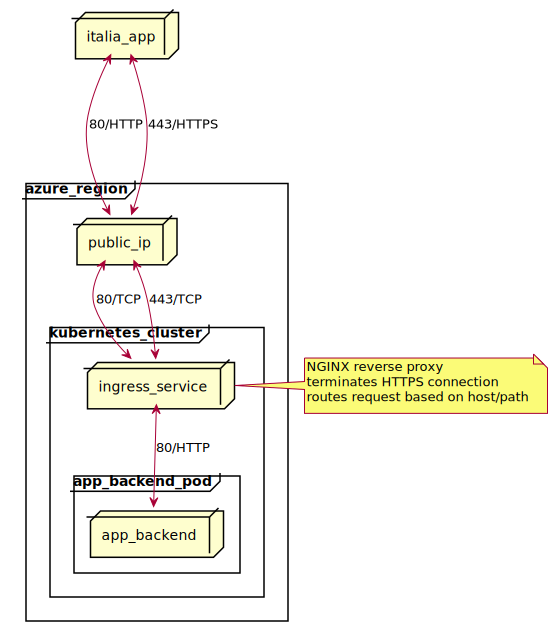

# 13. We decide how to expose the app backend to the internet

Date: 2018-02-09

## Status

Accepted

## Context

The frontend side of the Digital Citizenship project consists of a mobile
application named [italia-app](https://github.com/teamdigitale/italia-app).
The `italia-app` application relies on a backend application ([italia-backend](https://github.com/teamdigitale/italia-backend))
for intermediating the interaction with external services (e.g. the Digital
Citizenship APIs) and for coordinating the SPID authentication process.

## Decision

The backend application (`app_backend`) is deployed as a Docker container
inside a Kubernetes cluster, provisioned by Terraform.

[source of diagram](https://www.planttext.com/?text=XP7FIiGm4CRlynJp0cK5zo2oo887tSkoO0-2I4ZJsJPicyH9ilW7tzsaQbjwKCWXpFpovPlvjZv83h7l08oj2NMGdPP2EWTmPDaJolV899WQRGr-_60kLfrMGe_KALR4XW9veRhe0_78QjCmUIyyyLah6dMT4vLK9pArSBOUyLaTuFFtm6GCDqLHt4mMy1glBbRtPNdu6rglBmVg0M0gRpArSFWjMDuU_kUoPWPXsHhusIWpasdCGCYwQGFQ8pujdZu3xkzs-qTaEXFxj6kshs-0QQMzDZ9j68SfK5bZI8KK2o3Rc1jCBv5ym4fwgZ7brLeVLaw65hA7_370DbrJu5y0)

Requests coming from the app to the backend get routed through a few components:

  1. An Azure public IP with a firewall configured to listen on ports 80 and 443
  1. A [K8S Service](https://kubernetes.io/docs/concepts/services-networking/service/) that routes the ports 80 and 443 to the Ingress
  1. A [K8S Ingress](https://kubernetes.io/docs/concepts/services-networking/ingress/) that terminates the HTTPS connection and routes the request based on the HTTP `Host` and path
  1. The `italia-backend` app.

For details about the Service and the Ingress configuration, see
[ingress.yml](https://github.com/teamdigitale/digital-citizenship/blob/master/infrastructure/kubernetes/ingress.yml).

## Consequences

### Responsibilities of the backend application

  * it should listen on port 80 alone (since the Ingress terminates the HTTPS
    connection)
  * it should inspect `X-Forwarded-For` headers(s) in case it wants to know
    something about the client
  * avoid responding to HTTP requests

### Responsibilities of the Ingress

  * terminate the HTTPS connection
  * provision and renew TLS certificates via Cert Manager
  * (optional) rate limiting
