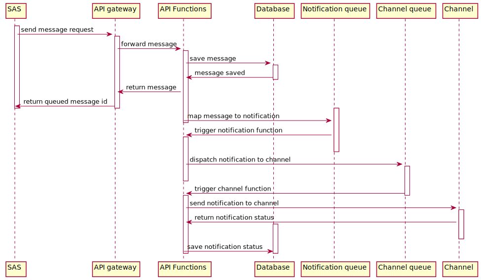

Modello di funzionamento
========================

.. image:: https://raw.githubusercontent.com/teamdigitale/io-functions/master/docs/digital-citizenship-api.png
  :alt:

#. Il client API invia una richiesta (HTTPS) all'endpoint del servizio
#. L'endpoint inoltra la richiesta al gestore delle API (*API gateway*)
#. L'API gateway valida le credenziali (API-Key) fornite dal client ed effettua un *look up* dell'utenza associata alle credenziali
#. L'API gateway inoltra la richiesta e gli attributi associati all'utenza al backend che realizza la logica applicativa (*API Function*)
#. Il backend controlla che l'utenza abbia i necessari permessi per eseguire l'operazione (API) richiesta e la processa; la maggior parte delle richieste `CRUD <https://it.wikipedia.org/wiki/Tavola_CRUD>`__ interagisce con il database documentale (*DB*).
#. Se la richiesta riguarda la creazione di un nuovo messaggio [1]_ questo viene salvato sul database e inoltrato a una coda (*New Messages*) di processamento
#. Per ogni messaggio che giunge in coda, viene attivata una funzione che crea una *notifica* [2]_ associata al messaggio e la inoltra ad una ulteriore coda (*New Notifications*)
#. Per ogni notifica la funzione ricava le informazioni sui recapiti digitali del destinatario, identificato da un codice fiscale,  tramite profilo salvato sul database. Se l'utente ha abilitato la memorizzazione dei messaggi (*Inbox*) il contenuto del messaggio viene salvato in un file (*blob storage*) e potrà esser recuperato in qualsiasi momento.
#. Se il destinatario ha configurato nel proprio profilo uno o più recapiti digitali (es. indirizzo email, numero di telefono, dispositivo mobile),   la notifica viene inoltrata su una ulteriora coda (una per canale)
#. Per ogni notifica che giunge nella coda specifica per un certo canale viene attivata una funzione che la processa
#. La funzione interagisce con un endpoint specifico per quel canale di inoltro (es. un MTA, un API di terze parti, etc.) che invierà il contenuto al destinatario
#. Il risultato della chiamata è memorizzato nel database (*Notification*) e potrà essere recuperato tramite l'API per interrogare lo stato della notifica inoltrata

Invio di una notifica per un messaggio
~~~~~~~~~~~~~~~~~~~~~~~~~~~~~~~~~~~~~~~~

Autenticazione e autorizzazioni
-------------------------------

L'autenticazione al servizio è gestita tramite un token (API-Key) fornito all'utente che si registra
al *developer portal* (portale delle adesioni).

Il token deve essere trasmesso dai client `REST <https://it.wikipedia.org/wiki/Representational_State_Transfer>`__
tramite un header HTTP custom (*Ocp-Apim-Subscription-Key*).

Ad esempio, tramite `cURL <https://curl.haxx.se/>`__:

.. code:: bash

  curl -X GET \
    https://api.cd.italia.it/api/v1/info \
    -H 'accept: application/json'
    -H 'content-type: application/json' \
    -H 'Ocp-Apim-Subscription-Key: a1b2c3d4e5f6g7h8i9l0'

I diritti di accesso alle operazioni (singole API) sono basati sull'appartenenza dell'utente
(associato all'API-Key) a specifici sottoinsiemi di "gruppi" creati all'interno del servizio di API management;
ad esempio gli utenti appartenenti al gruppo `ProfileRead` hanno accesso in lettura alle informazioni
memorizzate nei profili degli utenti.

In genere per ogni risorsa esiste almeno un gruppo che ne permette la lettura ed eventualmente 
uno che ne permette la scrittura (es. `ProfileRead`, `ProfileWrite`).

.. [1] Per *messaggio* si intende un contenuto testuale (titolo, corpo) associato a metadati che vengono salvati sul database.
.. [2] Per *notifica* si intende un messaggio inoltrato su uno dei canali associati al destinatario (es. email, push notification).
