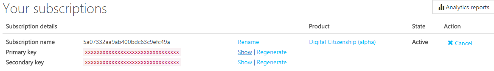

# Quick start

## Registrarsi all'ambiente di test delle API

Puoi richiedere accesso da subito all'ambiente di test per le API,
in modo da provare l'invio dei primi messaggi tramite il sistema di notifiche.

[Registrati sul portale sviluppatori](https://agid-apim-prod.portal.azure-api.net) -> "Sign up now"

Ti verranno chieste le seguenti informazioni:

- un indirizzo email valido
- nome utente
- password
- nome
- cognome
- nome dell'amministrazione ("Organization") di appartenenza (verrà inserito nel contenuto dei messaggi inviati)
- nome del servizio in cui vuoi integrare le notifiche (es. "avvisi di scadenza")
- dipartimento (area) dell'amministrazione a cui afferisce il servizio di notifica

Una volta avuto accesso al portale sviluppatori segui il link
**"Subscribe to the Digital Citizenship API"** e attendi
che la sottoscrizione venga attivata.

Al momento dell'attivazione riceverai un'email:
da quel momento è possibile iniziare a utilizzare l'API in modalità di test.

L'email contiene un codice fiscale "fittizio" tramite il quale puoi utilizzare
l'**API per l'invio di messaggi**; ti verrano recapitati all'indirizzo
che hai fornito durante la registrazione.

### Differenze tra la sottoscrizione di test e produzione

Fin quando sarà attiva la modalità di test:

- non potrai inviare messaggi a indirizzi email diversi da quello che hai fornito in fase di registrazione
- non potrai inviare messaggi usando un codice fiscale diverso da quello che hai ricevuto durante la registrazione
- non potrai leggere / scrivere le preferenze associate a un codice fiscale (Profile API)
- il numero di richieste API che è possible inoltrare è limitato a 1000 per settimana

## Provare le API tramite il portale sviluppatori

Tramite il developer portal è possibile:

- consultare le spefiche delle API (OpenAPI / Swagger)
- visualizzare l'API-key, necessaria per utilizzare le API
- provare a inviare messaggi tramite l'[interfaccia grafica](https://agid-apim-prod.portal.azure-api.net/docs/services/digital-citizenship-api)

L'account di test è limitato all'utilizzo dell'API di invio dei messaggi ("submitMessage").
Per inviare un messaggio tramite API è necessario fornire in input il 
codice fiscale ottenuto durante la registrazione.

Nella [pagina con i dati relativi al tuo account](https://agid-apim-prod.portal.azure-api.net/developer)
puoi trovare l'Api-Key ("Primary key") che è necessario utilizzare per autenticarsi alle API.

## Generare un client dalle specifiche OpenAPI

Esistono diversi tool open source per generare i client delle API nei diversi linguaggi
di programmazione. Ad esempio tramite [Autorest](https://github.com/Azure/autorest), sviluppato da Microsoft,
è possibile generare client in C#, Go, Java, Node.js, TypeScript, Python, Ruby and PHP.

[Specifiche OpenAPI per l'iniziativa di Cittadinanza Digitale](https://agid-apim-prod.portal.azure-api.net/docs/services/digital-citizenship-api/export?DocumentFormat=Swagger)
