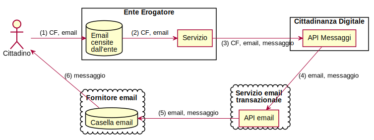
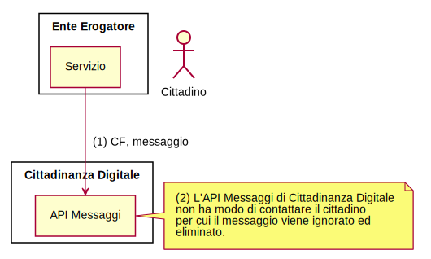

<!--
TODO: punto di vista dell'ente (esempio: superficie di attacco quando
l'ente esegue un invio massivo di messaggi)
TODO: flusso ente invio messaggi (se non ha email deve controllare se il cf ha un profilo)
-->

# Introduzione

## Cittadinanza Digitale

La Presidenza del Consiglio dei Ministri, in collaborazione con l’Agenzia per
l’Italia Digitale, ha progettato e sviluppato un sistema applicativo che si
presenta come il punto di accesso ai servizi delle pubbliche amministrazione e
degli altri soggetti pubblici indicati all’articolo 2, comma 2, del CAD (di
seguito, “Enti Erogatori”), quali appunto le società a controllo pubblico, non
quotate, e i gestori di pubblici servizi.

Tale sistema applicativo è fruibile attraverso la relativa applicazione mobile,
scaricabile gratuitamente dallo store preferito dall’utente cittadino,
disponibile per piattaforma sia Android, sia iOS. Le funzionalità legate alla
gestione dell’account, della privacy e della sicurezza saranno disponibili
anche tramite browser web.

L’applicazione di Cittadinanza Digitale (CD) rappresenta un canale
complementare o alternativo agli altri canali digitali già utilizzati dagli
Enti Erogatori, attraverso cui gli enti stessi metteranno a disposizione
dell’utente le funzioni descritte in seguito e relative ai propri servizi.

CD infatti, attraverso un’unica piattaforma applicativa, consente al cittadino
d'interagire con le amministrazioni italiane, centrali, locali e con
tutti gli Enti erogatori di servizi digitali.
CD assume pertanto un duplice valore: da un lato abilita i
soggetti pubblici a utilizzare una serie di funzioni comuni a
tutti i servizi digitali, dall’altro offre agli utenti cittadini uno
strumento unico per fruire di queste stesse funzioni.

CD, nella sua funzione di punto di accesso, permette all’utente di accedere
facilmente e in modalità aggregata alle proprie informazioni e ai servizi
digitali che lo riguardano, indipendentemente da quali siano gli Enti Erogatori
di suo specifico interesse. CD non si sostituisce in alcun modo agli Enti
Erogatori che rimangono pertanto titolari delle informazioni in loro possesso,
dei relativi trattamenti di dati personali e dell’erogazione dei relativi
servizi, che restano nella loro disponibilità esclusiva. Per questo CD si
configura semplicemente come un canale supplementare che permette agli
utenti di raggiungere - più facilmente e in modalità più razionalizzata -
le informazioni e i servizi degli Enti Erogatori.

Ferma ogni possibile implementazione nel tempo da parte della Presidenza del
Consiglio dei Ministri di altre funzionalità, allo stato attuale
l’applicazione di CD si compone di 5 sezioni principali che corrispondono a
cinque funzioni base comuni a molti servizi digitali:

* Messaggi;
* portafoglio;
* documenti;
* preferenze;
* profilo.

L’utente, previo l’opportuno download dell’applicazione in un dispositivo
compatibile, potrà accedere ai servizi autenticandosi tramite SPID. Disporre
di un account SPID valido sarà quindi condizione necessaria e sufficiente per
utilizzare CD.

Si descrivono di seguito le sezioni principali di cui si compone CD, che
corrispondono ad altrettante funzioni disponibili ai soggetti pubblici.

### Servizio messaggi

La sezione messaggi consentirà all’utente di ricevere le comunicazioni a lui
indirizzate da parte degli Enti Erogatori che utilizzano le api messe a
disposizione da CD e dagli altri servizi collegati.

L’utente potrà ordinare e/o filtrare i messaggi ricevuti sulla base di distinti
parametri, quali, ad esempio, la data di invio del messaggio, l’identificativo
del servizio oggetto del messaggio, l’oggetto indicato nel messaggio, etc.
Altri metadati ed altre funzioni di ricerca/ordinamento potranno essere
integrate nelle successive versioni di CD.

L’utente, se lo desidera, potrà beneficiare di ulteriori funzionalità collegate,
quali la possibilità di gestire le preferenze di recapito per uno specifico
servizio, condividere con terzi il messaggio, ricevere degli avvisi in merito
alla scadenza del messaggio, etc.

Per gli Enti Erogatori che aderiscono a CD sarà possibile interrogare un
servizio per sapere se uno specifico cittadino ha attivato CD e se ha delle
preferenze relative all’ente stesso.

### Portafoglio

La sezione portafoglio, integrata con il Sistema pagoPA, consente di gestire le
transazioni economiche fra il cittadino e lo stato, gestire i propri metodi di
pagamento preferiti e di avere a disposizione la lista delle transazioni già
eseguite, al pari delle più comuni applicazioni per i servizi di home banking.

Le funzioni di pagamento consentiranno di eseguire le transazione economiche
anche all’interno della stessa app di CD.

Se l’utente è censito nel sistema pagoPA potrà trovare nell’app lo storico di
alcune delle transazioni effettuate e le relative ricevute anche prima
dell’attivazione di CD.

L’utente in CD potrà salvare e gestire i metodi di pagamento previsti dal
sistema PagoPA.

### Documenti

La sezione documenti consente all’utente di tenere raccolti e da lui
organizzati dentro CD tutti i documenti che gli sono stati inviati o messi a
disposizione dagli Enti Erogatori.

I documenti saranno filtrabili e ricercabili secondo una serie di parametri
descritti dalle specifiche tecniche di CD, quali ad esempio data, tipologia,
titolo, descrizione, etc.

Gli Enti Erogatori dovranno mettere a disposizione, oltre al documento, il set
di metadati che consentono una corretta indicizzazione e ricerca sul documento,
come descritto nelle specifiche tecniche di CD per le quali si rinvia
all’allegato tecnico.

I documenti (ad esempio: certificati) che non sono disponibili potranno essere
richiesti direttamente dall’utente all’interno di CD, a condizione che il
processo di definizione delle caratteristiche del documento stesso consentano
una esperienza d’uso semplice e adatta ad un dispositivo mobile.

Gli Enti Erogatori dovranno semplificare il più possibile il processo di
generazione del documento o del certificato, così da renderlo compatibile con la
richiesta e la distribuzione tramite CD, e dovranno censire nel sistema CD i
documenti che sono in grado di erogare attraverso il sistema stesso.

Eventuali costi associati alla generazione di alcuni di questi documenti e
certificati (come, ad esempio, marche da bollo e/o diritti di segreteria)
potranno essere sostenuti direttamente attraverso le funzioni di pagamento
disponibili nella sezione portafoglio di CD.

Tutti i documenti erogati dagli Enti Erogatori devono essere in formato
digitale, devono avere il set di metadati descritto nelle specifiche tecniche
di CD, e devono essere resi disponibili, altresì, in modo da garantire per
l’utente l’esperienza qui sopra descritta.

A titolo di esempio, si segnala l’integrazione con ANPR (Anagrafe Nazionale
della Popolazione Residente), che consentirà di inoltrare la richiesta di un
certificato anagrafico ai comuni già integrati con ANPR, ottenendo da essi il
certificato richiesto direttamente con l’applicazione di CD.

### Preferenze

La sezione preferenze consente all’utente di impostare quelle scelte di
carattere generale che risultano trasversali all’erogazione dei servizi da
parte della pubblica amministrazione. Alcune di queste scelte, una volta
inserite dall’utente potranno essere interrogate e utilizzate in tempo reale
dagli Enti Erogatori che aderiscono a CD.

Di seguito, si riportano a titolo di esempio alcune preferenze che potranno
essere definite dell’utente:

* Lingua, da scegliere tra italiano, inglese o tedesco (interrogabile);
* email personale dell’utente;
* elenco dei servizi che l’utente può attivare e relativa modalità di recapito
  da scegliere tra messaggio sull’applicazione mobile, notifica push sul
  cellulare, messaggio email;
* elezione, modifica o disattivazione del domicilio digitale dell’utente
  (interrogabile).

A ciascun Ente Erogatore sarà chiesto di fornire un insieme base di
informazioni che comporranno una scheda ente e un equivalente insieme di
informazioni base per ciascuno dei servizi che usano le funzioni di CD. Queste
informazioni potranno essere esposte in CD all’interno di una sezione dedicata
a ciascun ente/servizio, collegata alle preferenze di quel servizio stesso.

Con riferimento alla selezione delle preferenze, appare opportuno segnalare che:

* La selezione da parte dell’utente del servizio di inbox, determina l’invio
  da parte degli Enti Erogatori di un messaggio di notifica al cittadino che
  genera la presenza del messaggio nella schermata Messaggi dell’applicazione
  mobile di CD sullo smartphone dell’utente;
* la selezione da parte dell’utente del servizio di ricezione via email,
  determina l’invio da parte degli Enti Erogatori di un messaggio di notifica
  al cittadino che genera una email ricevuta nella casella di posta indicata
  dall’utente;
* la selezione da parte dell’utente del servizio di notifica push, determina
  l’invio da parte degli Enti Erogatori di un messaggio di notifica push sullo
  smartphone indicato dall’utente.

### Profilo

La sezione Pprofilo, che sarà disponibile anche tramite browser web, consente
all’utente di avere un riepilogo delle informazioni più tipicamente legate alla
propria identità.

In questa sezione, infatti, l’utente potrà accedere e
verificare i dati anagrafici acquisiti da CD tramite il login effettuato con
SPID.

L’eventuale aggiornamento di dati anagrafici in CD non verrà propagato agli
Identity Provider SPID.

Nella stessa sezione Profilo l’utente potrà gestire eventuali strumenti
complementari di identificazione e sicurezza quali PIN o, se abilitati
dall’utente sul proprio dispositivo, strumenti di identificazione biometrica, e
potrà interrompere la sessione attualmente attiva sull’applicazione (logout).

Nella sezione profilo l’utente potrà vedere le proprie informazioni anagrafiche
messegli a disposizione tramite un’integrazione con ANPR, a condizione
che il Comune di residenza dell’utente sia già subentrato in ANPR.

Nella sezione profilo l’utente potrà inoltre:

* verificare i termini e condizioni d’uso del servizio in vigore;
* consultare le informative sul trattamento dei dati personali degli Enti Erogatori e una breve informativa relativa a CD;
* chiedere la sospensione dell’account o la completa cancellazione dello stesso.

## Motivazioni alla base della valutazione d'impatto

### Gestione di dati personali

Tramite le funzionalità dei Messaggi e Documenti, la piattaforma informatica di
CD tratterà documenti personali e messaggi di cortesia equiparabili a messaggi
di posta elettronica. Inoltre, per quanto riguarda la funzionalità di Profilo,
la piattaforma informatica di CD tratterà metadati relativi ai servizi ed
Enti Erogatori da cui un cittadino a ricevuto messaggi di cortesia e avvisi di
pagamento.

### Trattamento di dati su larga scala

L'obiettivo di CD è quello di fornire un servizio a tutta la popolazione
italiana dotata di account SPID. Si concretizza quindi lo scenario del
trattamento di dati su larga scala.[^largascala]

[^largascala]: Cfr. _Linee guida sui responsabili della protezione dei dati (RPD)_ del WP29 - 16/EN WP 243.

\pagebreak

# Descrizione dei flussi informativi

<!--
**TODO**
The collection, use and deletion of personal data should be described here and it may also be useful to refer to a flow diagram or another way of explaining data flows. You should also say how many individuals are likely to be affected by the project.

Explain how information will be obtained, used, and retained – there may be several options to consider. This step can be based on, or form part of, a wider project plan.

1. This process can help to identify potential ‘function creep’ - unforeseen or unintended uses of the data (for example data sharing)
1. People who will be using the information are consulted on the practical implications.
1. Potential future uses of information are identified, even if they are not immediately necessary.

* The collection, use and deletion of personal data should be described here
* how information will be obtained, used, and retained
* You should also say how many individuals are likely to be affected

-->

## Funzionalità preferenze

Questa funzionalità ha lo scopo di gestire le preferenze del
cittadino all'interno di CD. Le preferenze associate ad ogni cittadino
(Tabella \vref{tabella-preferenze}) guidano
molte delle logiche implementate in CD.
Inoltre alcune preferenze (dette pubbliche) vengono
condivise con gli Enti Erogatori allo scopo di essere utilizzate per la
personalizzazione dei servizi forniti da essi.

Table: preferenze associate al cittadino - le preferenze nella forma di domanda sono preferenze di abilitazione (booleani) \label{tabella-preferenze}

Preferenza                Provenienza         Pubblica?     Uso
-----------               ------------        ----------    ----
Lingue preferite          APP                 SI            UI e messaggi multilingua
Casella dei messaggi?     APP                 NO            Messaggi
Notifiche push?           APP                 NO            Messaggi
Servizi abilitati?        APP                 NO            Messaggi
Indirizzo email           SPID                NO            Messaggi
Storico accessi           Backend app         NO            Profilo

Nel database delle preferenze vengono mantenute le informazioni descritte nella
Tabella \vref{tabella-preferenze} per ogni cittadino che si registra a CD e fino
a quando il cittadino non fa richiesta di rimozione dei suoi dati. Le preferenze
sono associate al cittadino usando il codice fiscale[^cf-chiave-primaria] come chiave primaria.

[^cf-chiave-primaria]: Potremmo anche usare la hash del codice fiscale.

### Creazione del profilo \label{scenario-creazione-profilo}

La creazione del profilo del cittadino (che contiene le preferenze), avviene
al primo accesso del cittadino all'APP tramite SPID.

Il flusso di creazione del profilo (Figura \vref{figura-profilo-creazione}) è il seguente:

1. Il cittadino apre l'APP e inizia il processo di autenticazione SPID
2. L'APP redirige il cittadino sull'IdP prescelto e il cittadino inserisce
   le credenziali di accesso.
3. Ad autenticazione avvenuta, l'IdP invia gli attributi SPID al backend
   dell'APP (che nel flusso di autenticazione SPID svolge il ruolo di
   _service provider_.
4. Il backend dell'APP invia gli attributi SPID alle API di gestione preferenze
   di CD, che li salva nel database delle preferenze.
5. L'app genera un identificativo di installazione univoco che viene comunicato
   al servizio di invio delle _notifiche push_, associandolo alla hash _SHA256_
   [^sha256] del codice fiscale del cittadino.

{ width=100% }

[^sha256]: <https://en.wikipedia.org/wiki/SHA-2>

### Lettura delle preferenze pubbliche da parte dell'ente

Come descritto nella Tabella \vref{tabella-preferenze}, alcune preferenze vengono
definite _pubbliche_ e vengono condivise con gli enti che ne fanno richiesta.
Queste preferenze non contengono informazioni personali o sensibili ma sono
assimilabili a semplici indicazioni che il cittadino vuole condividere con gli
enti per essere usate come base per la personalizzazione dei servizi digitali.

Un servizio digitale fornito dall'ente al cittadino può interrogare le preferenze
pubbliche del cittadino sulla base del codice fiscale dello stesso e usare
le informazioni ottenute per fornire un servizio personalizzato, ad esempio
traducendo l'interfaccia utente del servizio fornito al cittadino sulla base
della preferenza di lingua.

La funzione Preferenze può inoltre essere utilizzata dal servizio dell'ente
per sapere se il cittadino non intende ricevere comunicazioni dal servizio.
Questa verifica è richiesta all'ente, prima dell'invio di una comunicazione
al cittadino attraverso la funzione Messaggi, secondo lo schema in Tabella
\vref{table-verifica-optout}.

Table: Verifica da parte del servizio del permesso di comunicare col cittadino \label{table-verifica-optout}

Cit. iscritto a CD?       Opt-out al servizio?      Servizio può inviare messaggio?
--------------------      ---------------------     --------------------------------
NO                        /                         _Solo se censito indirizzo email_
SI                        NO                        **SI**
SI                        SI                        NO

\pagebreak

## Funzionalità Messaggi

La funzionalità Messaggi fornisce il servizio che permette agli Enti Erogatori
di inviare comunicazioni di cortesia e avvisi di pagamento ai cittadini.

Le comunicazioni di cortesia sono sempre inviate ad uno specifico cittadino
(identificato tramite codice fiscale) e scaturiscono da una pregressa
relazione individuale tra l'Ente e il cittadino. Da queste comunicazioni sono
quindi escluse comunicazioni non personali (_broadcast_). Si veda l'allegato
tecnico per alcuni esempi di tipologie di messaggi coperte
da questo servizio (Tabella \vref{tabella-esempi-messaggi}).

Quando l'Ente Erogatore invia un messaggio, comunica a CD i seguenti dati:

* **Identificativo del servizio** che ha generato il messaggio (es. servizio
  anagrafe).
* **Codice Fiscale** del cittadino a cui recapitare il messaggio.
* **Oggetto** del messaggio.
* **Contenuto** del messaggio.
* **Indirizzo email di default** del cittadino a cui inviare la comunicazione (opzionale,
  da usare nel caso il cittadino non abbia già un profilo su CD, vedere
  § \vref{scenario-messaggio-default_email-noprofile}).
* **Data** associata al messaggio (opzionale, nel caso si tratti di una
  scadenza).
* **Identificativo Unico di Versamento** (opzionale, nel caso si tratti di un
  avviso di pagamento).

Una volta ricevute queste informazioni, il servizio Messaggi di CD esegue delle
logiche di gestione del dato che variano a seconda della tipologia di messaggio
e della configurazione delle preferenze del cittadino a cui è indirizzato lo
stesso.

Possiamo classificare i possibili scenari in due macro gruppi:

1. La gestione del messaggio quando il cittadino destinatario NON ha ancora
   effettuato il primo accesso all'applicazione di CD;
1. La gestione del messaggio quando il cittadino destinatario ha già effettuato
   il primo accesso all'applicazione di CD.

Questa distinzione è importante poichè quando il cittadino non ha ancora
effettuato il primo accesso all'applicazione di CD, non esiste ancora un suo
profilo nel sistema e la funzionalità di invio messaggi di CD è equiparabile ad
un servizio di email transazionale.[^cosa-email-transazionale]

Prima di inviare una comunicazione al cittadino tramite la funzionalità
Messaggi, il servizio è tenuto a verificare la disponibilità del cittadino a
ricevere la comunicazione (come descritto precedentemente nella Tabella
\vref{table-verifica-optout}).

[^cosa-email-transazionale]: si veda per esempio il servizio
  [MailUP](https://www.mailup.it/funzionalita/email/smtp/) usato da molte
  Pubbliche Amministrazioni per l'invio di avvisi di cortesia via email ai
  cittadini.

### Invio di messaggi a cittadini senza un profilo CD

Nei seguenti scenari, il cittadino destinatario del messaggio non si è ancora
iscritto al servizio di Cittadinanza Digitale.

#### Scenario in cui il cittadino ha fornito all'Ente il proprio indirizzo email \label{scenario-messaggio-default_email-noprofile}

In questo scenario (Figura \vref{figura-messaggio-default_email-noprofile}), il
cittadino si è precedentemente accreditato presso il servizio dell'ente che
intende inviare il messaggio. Il cittadino ha quindi fornito il proprio indirizzo
email ed ha acconsentito l'ente a contattarlo per comunicazioni inerenti
al servizio d'interesse.

Il flusso dati è il seguente:

1. Il cittadino fornisce all'Ente Erogatore il proprio indirizzo email.
2. Quando il servizio dell'Ente Erogatore intende comunicare al cittadino,
   recupera l'indirizzo email di recapito dal propdio database di contatti.
3. Il servizio dell'Ente Erogatore invia (tramite le API Messaggi) il messaggio
   da recapitare al cittadino, con associato l'indizzo email fornitogli.
4. La logica delle API messaggi, non trovando le preferenze del cittadino nel
   proprio database (siamo nello scenatio di cittadini senza profilo CD),
   utilizza l'indirizzo email fornitogli dall'Ente Erogatore per recapitare
   il messaggio via email tramite uno dei servizi di invio email transazionale
   utilizzati da CD.
5. Il servizio di invio email transazionale invia l'email con il messaggio al
   fornitore email del cittadino.
6. Il cittadino trova il messaggio nella sua casella di posta.

{ width=100% }

#### Scenario in cui il cittadino non ha fornito all'Ente il proprio indirizzo email

In questo scenario (Figura \vref{figura-messaggio-noprofile}), il
cittadino non si è precedentemente accreditato presso il servizio dell'ente che
intende inviare il messaggio. Il servizio quindi tenta di inviare il messaggio
tramite il servizio Messaggi fornendo solo il codice fiscale del destinatario,
contando sul fatto che il destinatario possa aver espresso delle preferenze di
contatto nel suo profilo di CD. In questo caso però, il cittadino destinatario
del messaggio non si è ancora iscritto al servizio di Cittadinanza Digitale,
quindi il messaggio viene ignorato.

1. Il servizio dell'Ente Erogatore invia (tramite le API Messaggi) il messaggio
   da recapitare al cittadino.
2. L'API messaggi, non avendo preferenze di contatto per il cittadino
   destinatario, ignora il messaggio.

{ width=100% }

### Invio di messaggi a cittadini con un profilo CD

Quando il cittadino accede per la prima volta, attraverso SPID, all'app di CD,
viene creato un profilo di preferenze dentro CD associato al codice fiscale del
cittadino (§ \vref{scenario-creazione-profilo}). Gli scenari seguenti assumono
quindi l'esistenza di un profilo contente le preferenze del cittadino.

I seguenti scenari non sono mutuamente esclusivi e possono concretizzarsi
contemporaneamente all'invio di un messaggio, a seconda delle preferenze
espresse dal cittadino.

A tutti gli scenari viene applicato un filtro alla ricezione del messaggio che
verifica che il servizio mittente sia stato abilitato dal cittadino (preferenza
_Servizi abilitati_). Nel caso in cui il servizio non sia stato abilitato dal
cittadino, il messaggio viene scartato immediatamente.

#### Scenario in cui il cittadino ha abilitato la casella dei messaggi

La casella dei messaggi è un database che, se abilitato dal cittadino, archivia
i messaggi inviati dagli enti al cittadino stesso. Un messaggio archiviato nella
casella dei messaggi contiene i seguenti dati:

* **Identificativo del servizio** che ha generato il messaggio.
* **Oggetto** del messaggio.
* **Contenuto** del messaggio.
* **Data** associata al messaggio (se presente).
* **Identificativo Unico di Versamento** (se presente).

Nel caso in cui il cittadino abbia abilitato la casella dei messaggi nelle
proprie preferenze, all'invio di un messaggio da parte dell'ente avvengono i
seguenti passaggi (Figura \vref{figura-messaggio-profile-inbox}):

1. Il servizio dell'ente invia al servizio messaggi un messaggio associato al
   codice fiscale del cittadino.
2. Il servizio messaggi recupera le preferenze del cittadino destinatario.
3. Tra le preferenze troverà l'abilitazione della casella dei messaggi e
   procederà quindi a salvare il contenuto del messaggio nel database dei
   messaggi.
4. Quando il cittadino apre l'app nella schermata dei Messaggi, l'app farà una
   richiesta per ottenere il contenuto dei messaggi al backend dell'app.
5. Il backend dell'app farà a sua volta una richiesta al servizio Messaggi,
   ottenendo il contenuto dei messaggi ed il relativo mittente.
6. Il cittadino visualizza il contenuto dei messaggi nell'app.

Si noti che i passi 4-6 possono avvenire in un momento diverso rispetto
all'invio del messaggio da parte del servizio.

{ width=100% }

#### Scenario in cui il cittadino ha abilitato l'invio di email

Nel caso in cui il cittadino abbia abilitato il canale email nelle
proprie preferenze, avvengono i seguenti passaggi
(Figura \vref{figura-messaggio-profile-email}):

1. Il servizio dell'ente invia al servizio messaggi un messaggio associato al
   codice fiscale del cittadino.
2. Il servizio messaggi recupera le preferenze del cittadino destinatario,
   tra le quali troverà l'abilitazione alla notifica via email con
   associato l'indirizzo email su cui il cittadino vuole essere contattato.
3. Il servizio Messaggi invia il messaggio all'indirizzo email traimte uno dei
   servizi di invio email transazionale a disposizione.
4. Il servizio di invio email transazionali recapita il messaggio nella casella
   di posta elettronica del cittadino.
5. Il cittadino visualizza il contenuto del messaggi nel suo client di posta
   elettronica.

{ width=100% }

#### Scenario in cui il cittadino ha abilitato l'invio di notifiche push all'app

Nel caso in cui il cittadino abbia abilitato l'invio di notifiche push nelle
proprie preferenze, avvengono i seguenti passaggi
(Figura \vref{figura-messaggio-profile-push}):

1. Il servizio dell'ente invia al servizio messaggi un messaggio associato al
   codice fiscale del cittadino.
2. Il servizio messaggi recupera le preferenze del cittadino destinatario.
3. Tra le preferenze troverà l'abilitazione della casella dei messaggi e delle
   notifiche push[^preferenze-notifiche-casella] e procederà quindi a salvare
   il contenuto del messaggio nel database dei messaggi.
4. Il servizio Messaggi invierà una notifica al backend dell'app, avvertendolo
   che è necessario inviare una notifica push all'app perché un nuovo messaggio
   è disponibile nella casella dei messaggi.
5. Il backend dell'app istruisce il servizio di invio di notifiche push ad
   inviare una notifica push all'app associata alla hash del codice fiscale.[^notifica-hash-cf]
6. Il servizio di notifica push invia una notifica all'app.[^notifica-ios-android]
7. Alla ricezione della notifica, quando il cittadino apre l'app, l'app farà una
   richiesta per ottenere il contenuto dei messaggi al backend dell'app. Il backend dell'app farà a sua volta una richiesta al servizio Messaggi,
   ottenendo il contenuto dei messaggi ed il relativo mittente.
8. Il cittadino visualizza il contenuto dei messaggi nell'app.

{ width=100% }

[^preferenze-notifiche-casella]: L'invio delle notifiche push sull'app richiede che sia abilitata la casella dei messaggi, per permettere all'app di recuperare il contenuto del messaggio (che non viene inviato tramite la notifica push).

[^notifica-hash-cf]: Utilizziamo la hash del codice fiscale in modo che il dato in chiaro del codice fiscale del cittadino non venga salvato nel database del servizio di invio notifiche push (in questo modo il codice fiscale viene pseudoanonimizzato).

[^notifica-ios-android]: La notifica viene inoltrata ai servizi di notifica di Google o di Apple a seconda della tipologia di device su cui è stata installata l'app.

\pagebreak

## Funzionalità Portafoglio

La funzionalità _Portafoglio_ fornisce la possibilità di pagare tributi tramite
gli strumenti di pagamento forniti da pagoPA.

Nel contesto delle funzionalità di pagamento, consideriamo due macro flussi:

* La gestione preferenze di pagamento del cittadino (es. aggiunta di una carta
di credito).
* Il flusso di pagamento (es. da un avviso di pagamento digitale).

### Gestione preferenze di pagamento

Il flusso di pagamento prevede che il cittadino abbia preimpostati nel suo
portafoglio dei metodi di pagamento validi (es. carta di credito) da poter
utilizzare per effettuare il pagamento del tributo.

Attualmente la funzionalità portafoglio è progettata per gestire pagamenti
tramite carta di credito.

Le informazioni sui metodi di pagamento vengono gestite attraverso la componente
_Wallet_ di PagoPA che si occupa della gestione sicura delle informazioni
sensibili (es. dati della carta di credito).

#### Inserimento dati della carta di credito

L'inserimento dei dati della carta dicredito nell'app avviene attraverso una
componente applicativa (SDK) fornita e certificata da SIA SpA che permette di
presentare all'utente una form di inserimento, che comunica in modo sicuro
con il Wallet di PagoPA. I dati della carta di credito inseriti dall'utente
vengono inviati direttamente al sistema PagoPA senza passare dal sistema di CD.

Una volta salvati, i dati della carta di credito vengono associati ad un
identificativo numerico non correlato con il numero di carta di credito
(identificativo dello strumento di pagamento).

L'identificativo dello strumento di pagamento viene fornito all'app e utilizzato
nella scelta del metodo di pagamento durante il flusso di pagamento.

#### Riconciliazione profilo CD e profilo pagoPA

Le preferenze di pagamento gestite dal Wattet di PagoPA vengono associate ad
un indirizzo email, si richiede quindi un meccanismo di riconciliazione tra
i profili dei cittadini registrati sul Wallet e i cittadini che accedono
all'app di CD.

Questo meccanismo di riconciliazione si basa sull'indirizzo email fornito
dal cittadino sotto forma di attributo SPID.

Si delineano quindi due scenari in base alla presenza o meno di un profilo
nel Wallet di PagoPA corrispondente all'email associata all'account SPID
del cittadino.

##### Profilo Wallet presente

Nel caso sia presente nel Wallet, un profilo associato all'email del cittadino,
le interazioni con il Wallet attraverso l'app verranno resistrate esattamente
come se avvenissero da una qualsiasi app che integra l'SDK di PagoPA.

Questo meccanismo permette al cittadino di riutilizzare il suo profilo PagoPA
dall'APP IO in modo totalmente trasparente.

##### Profilo Wallet non presente

Nel caso non sia presente nel Wallet, un profilo associato all'email del cittadino,
il Wallet provvederà a creare un nuovo profilo[^wallet-nuovo-profilo]
all'inserimento del primo metodo di pagamento. Tutte le operazioni successive
ricadono nel caso precedente.

[^wallet-nuovo-profilo] Flusso ancora da formalizzare.

### Pagamento

Il flusso di pagamento può scaturire da un avviso di pagamento digitale
(ricevuto quindi attraverso la funzionalità Messaggi) o da un avviso di
pagamento cartaceo (che fornisce un codice di pagamento numerico o tramite
un QR code).

#### Avvisi di pagamento digitali

#### Avvisi di pagamento cartaceo

#### Verifica e attualizzazione

#### Transazione

#### Ricevuta

\pagebreak

## Funzionalità Documenti

### Avviso disponibilità documento

### Visualizzazione documento

\pagebreak

# Processo di analisi

<!--
**TODO**
Explain what practical steps you will take to ensure that you identify and address privacy risks. Who should be consulted, internally and externally? How will you carry out the consultation? You should link this to the relevant stages of your project management process.
Consultation can be used at any stage of the PIA process.
-->

\pagebreak

# Analisi dei rischi

<!--

**TODO**
Identify the key privacy risks and the associated compliance and corporate risks.

Record the risks to individuals, including possible intrusions on privacy where appropriate.

1. Assess the corporate risks, including regulatory action, reputational damage, and loss of public trust.
1. Conduct a compliance check against the Data Protection Act and other relevant legislation.
1. Maintain a record of the identified risks.
1. The process helps an organisation to understand the likelihood
   and severity of privacy risks.
1. An organisation is open with itself about risks and potential changes to a project.
-->

## (Oggetto)

### Rischi per le persone

**TODO**

### Rischi di aderenza

**TODO**

### Rischi per l'organizzazione

**TODO**

\pagebreak

# Soluzioni adottate

<!--
**TODO**
Describe the actions you could take to reduce the risks, and any future steps which would be necessary (e.g. the production of new guidance or future security testing for systems).

Devise ways to reduce or eliminate privacy risks.

1. Assess the costs and benefits of each approach, looking at the
   impact on privacy and the effect on the project outcomes.
1. Refer back to the privacy risk register until satisfied with the
   overall privacy impact.
1. The process takes into account the aims of the project and the impact on privacy.
1. The process also records privacy risks which have been accepted as necessary for the project to continue.
-->

## (Rischio)

### Soluzione

### Risultato

is the risk eliminated, reduced, or accepted?

### Valutazione

is the final impact on individuals after implementing each solution a justified, compliant and proportionate response to the aims of the project?

\pagebreak

# Stato di approvazione

<!--
**TODO**
Who has approved the privacy risks involved in the project? What solutions need to be implemented?

Obtain appropriate signoff within the organisation.

1. Produce a PIA report, drawing on material produced earlier
   during the PIA.
1. Consider publishing the report or other relevant information
   about the process.
1. The PIA is approved at a level appropriate to the project.
1. A PIA report or summary is made available to the appropriate stakeholders.
-->

| Rischio | Soluzione | Approvata da |
| ------- | --------- | ------------ |

\pagebreak

# Stato di implementazione

<!--
**TODO**
Who is responsible for integrating the PIA outcomes back into the project plan and updating any project management paperwork? Who is responsible for implementing the solutions that have been approved? Who is the contact for any privacy concerns which may arise in the future?

Ensure that the steps recommended by the PIA are implemented.

1. Continue to use the PIA throughout the project lifecycle when appropriate.
1. The implementation of privacy solutions is carried out and recorded.
1. The PIA is referred to if the project is reviewed or expanded in the future.
-->

| Risultato da conseguire | Data prevista | Responsabile |
| ----------------------- | ------------- | ------------ |

\pagebreak

# Allegato tecnico

## Esempi di comunicazioni gestibili dal servizio Messaggi {#esempi-messaggi}

Table: Esempi di messaggi personalizzati \label{tabella-esempi-messaggi}

Ente Erogatore                Oggetto
---------------               --------
Agenzia delle Entrate         Notifiche di cortesia cartelle esattoriali
Agenzia delle Entrate         Avvisi di cortesia scadenze
Agenzia delle Entrate         Visure catastali
Agenzia delle Entrate         Pagamento spese per immobili
Agenzia delle Entrate         Accredito rimborsi
Comune                        Avviso multa
Comune                        Avviso TARI
Comune                        Avviso scadenza rette scolastiche
Comune                        Mense scolastiche
Comune                        Scadenze documenti di identità
Comune                        Scadenza tessera elettorale
Ministero dei Trasporti       Scadenza revisione
Ministero dei Trasporti       Punti patente
Ministero dei Trasporti       Scadenza patente
ACI                           Bollo Auto

## Diagrammi architetturali

Diagramma                   Figura
----------                  --------
Infrastruttura fisica       Figura \ref{figura-infrastruttura-fisica}
Infrastruttura sistema      Figura \ref{figura-infrastruttura-sistema}
Infrastruttura rete         Figura \ref{figura-infrastruttura-rete}
Infrastruttura piattaforma  Figura \ref{figura-infrastruttura-piattaforma}
Infrastruttura applicativa  Figura \ref{figura-infrastruttura-applicativa}

{ width=100% }

{ width=100% }

{ width=100% }

{ width=100% }

{ width=100% }

### Infrastruttura dati

**TODO** storage nell'app (device), storage backend (redis), cosmos (repliche), code
policy di retention, backup, criptazione dei dati a riposo

## Accesso ai dati e sicurezza

### Meccanismi di autenticazione tra le componenti

#### Autenticazione app mobile

##### Autenticazione via SPID

**TODO** flusso di autenticazione SPID/IDP/Backend

##### Autenticazione via PIN e Biometrico

**TODO**

##### Autenticazione verso il backend dell'app

**TODO**

##### Autenticazione verso il Payment Manager/Wallet PagoPA

L'app effettua delle chiamate direttamente alle API del Payment Manager/Wallet
di PagoPA, per la gestione dei metodi di pagamento e delle transazioni.

Queste chiamate devono contenere un token di autenticazione che permetta a
PagoPA di identificare il cittadino e riconiliare la sua identitità con
l'eventuale profilo già presente nel sistema PagoPA.

**TODO** flusso

##### Invalidazione delle sessioni

**TODO** flusso

#### Autenticazione API CD

##### Verso gli Enti Erogatori

##### Verso il backend dell'app mobile

#### Autenticazione pagoPA

##### VPN

**TODO**