<!--
TODO: punto di vista dell'ente (esempio: superficie di attacco quando
l'ente esegue un invio massivo di messaggi)
TODO: flusso ente invio messaggi (se non ha email deve controllare se il cf ha un profilo)
-->

# Introduzione

Questo documento è una valutazione dell'impatto sulla protezione dei dati (DPIA)
che valuta il servizio di Cittadinanza Digitale che la Presidenza del Consiglio dei Ministri vuole offrire ai cittadini ed alle Pubbliche Amministrazioni italiane.

La DPIA è un'analisi delle attività di trattamento dei dati e copre i dettagli
dell'attività di elaborazione degli stessi e una valutazione dei rischi
associati al trattamento, comprese eventuali misure che devono essere adottate
per mitigare tali rischi. Contiene anche la decisione sull'avvio di una
consultazione preliminare con il _Data Protection Officer_ competente.

La presente DPIA viene prodotta ai sensi dell'articolo 35 del GDPR - laddove il
trattamento può comportare un rischio elevato per i diritti e le libertà
delle persone fisiche, il responsabile del trattamento effettua una
valutazione dell'impatto dell'elaborazione prevista.

Le valutazioni hanno valore per gli individui, le organizzazioni e la società.
La presente DPIA valuta i rischi per la privacy personale e identifica le
misure, le salvaguardie e i meccanismi esistenti per mitigare tali rischi.

## Informazioni chiave

* **Titolarità e responsabilità dei dati**: Gli Enti Erogatori aderenti al
  servizio rimangono titolari dei dati personali, mentre l’Agenzia per
  l’Italia Digitale (AgID) viene nominata responsabile degli stessi dagli
  Enti.
* **Descrizione del progetto**: Questo documento di analisi d'impatto riguarda il
  progetto di Cittadinanza Digitale descritto nel capitolo seguente.
* **Soggetti oggetto del trattamento dei dati**: Pubbliche Amministrazioni Italiane
  e Cittadini Italiani dotati di identità digitale (SPID).
* **Tipologie di dati personali**: Le tipologie di dati trattati in questo progetto
  includono informazioni personali quali nome, cognome, codice fiscale degli
  utenti del servizio e contenuto dei messaggi inviati dalle
  Pubbliche Amministrazioni ai cittadini - si faccia riferimento al §
  \vref{descrizione-flussi-informativi} per l'elenco completo dei dati personali
  trattati.
* **Categorie speciali di dati trattati**: Nessuna.
* **Soggetti che hanno accesso ai dati trattati**: I seguenti soggetti avranno
  accesso ai dati trattati dal sistema:
  * Soggetti gestori del servizio autorizzati.
  * Cittadini aderenti al servizio, per quanto riguarda i propri dati SPID e i
    dati ricevuti dai servizi erogati dagli Enti.
  * Enti Erogatori al servizio, per quanto riguarda i dati inviati ai cittadini
    e le preferenze condivise dai singoli cittadini con i servizi erogati
    dall'Ente - si faccia riferimento al § \vref{descrizione-flussi-informativi}
    per l'elenco completo dei soggetti coinvolti nel trattamento dei dati.

\pagebreak

# Il progetto Cittadinanza Digitale

La Presidenza del Consiglio dei Ministri, in collaborazione con l’Agenzia per
l’Italia Digitale, ha progettato e sviluppato un sistema applicativo che si
presenta come il punto di accesso ai servizi delle pubbliche amministrazione e
degli altri soggetti pubblici indicati all’articolo 2, comma 2, del CAD (di
seguito, “Enti Erogatori”), quali appunto le società a controllo pubblico, non
quotate, e i gestori di pubblici servizi.

Tale sistema applicativo è fruibile attraverso la relativa applicazione mobile,
scaricabile gratuitamente dallo store preferito dall’utente cittadino,
disponibile per piattaforma sia Android, sia iOS. Le funzionalità legate alla
gestione dell’account, della privacy e della sicurezza saranno disponibili
anche tramite browser web.

L’applicazione di Cittadinanza Digitale (CD) rappresenta un canale
complementare o alternativo agli altri canali digitali già utilizzati dagli
Enti Erogatori, attraverso cui gli enti stessi metteranno a disposizione
dell’utente le funzioni descritte in seguito e relative ai propri servizi.

CD infatti, attraverso un’unica piattaforma applicativa, consente al cittadino
d'interagire con le amministrazioni italiane, centrali, locali e con
tutti gli Enti erogatori di servizi digitali.
CD assume pertanto un duplice valore: da un lato abilita i
soggetti pubblici a utilizzare una serie di funzioni comuni a
tutti i servizi digitali, dall’altro offre agli utenti cittadini uno
strumento unico per fruire di queste stesse funzioni.

CD, nella sua funzione di punto di accesso, permette all’utente di accedere
facilmente e in modalità aggregata alle proprie informazioni e ai servizi
digitali che lo riguardano, indipendentemente da quali siano gli Enti Erogatori
di suo specifico interesse. CD non si sostituisce in alcun modo agli Enti
Erogatori che rimangono pertanto titolari delle informazioni in loro possesso,
dei relativi trattamenti di dati personali e dell’erogazione dei relativi
servizi, che restano nella loro disponibilità esclusiva. Per questo CD si
configura semplicemente come un canale supplementare che permette agli
utenti di raggiungere - più facilmente e in modalità più razionalizzata -
le informazioni e i servizi degli Enti Erogatori.

Ferma ogni possibile implementazione nel tempo da parte della Presidenza del
Consiglio dei Ministri di altre funzionalità, allo stato attuale
l’applicazione di CD si compone di 4 sezioni principali che corrispondono a
cinque funzioni base comuni a molti servizi digitali:

* Messaggi;
* Portafoglio;
* Preferenze;
* Profilo.

L’utente, previo l’opportuno download dell’applicazione in un dispositivo
compatibile, potrà accedere ai servizi autenticandosi tramite SPID. Disporre
di un account SPID valido sarà quindi condizione necessaria e sufficiente per
utilizzare CD.

Si descrivono di seguito le sezioni principali di cui si compone CD, che
corrispondono ad altrettante funzioni disponibili ai soggetti pubblici.

## Servizio messaggi

La sezione messaggi consente all’utente di ricevere le comunicazioni a lui
indirizzate da parte degli Enti Erogatori che utilizzano le API messe a
disposizione da CD.

L’utente può ordinare e/o filtrare i messaggi ricevuti sulla base di distinti
parametri, quali, ad esempio, la data di invio del messaggio, l’identificativo
del servizio mittente del messaggio, l’oggetto indicato nel messaggio, etc.
Altri metadati ed altre funzioni di ricerca/ordinamento potranno essere
integrate nelle successive versioni di CD.

L’utente, se lo desidera, potrà beneficiare di ulteriori funzionalità collegate,
quali la possibilità di gestire le preferenze di recapito per uno specifico
servizio, condividere con terzi il messaggio, ricevere degli avvisi in merito
alla scadenza legata al messaggio (nel caso, per esempio, di avvisi di pagamento), etc.

Per gli Enti Erogatori che aderiscono a CD è possibile interrogare un
servizio per sapere se uno specifico cittadino ha attivato CD e se ha espresso delle preferenze relative all’ente stesso (per esempio nel caso in cui il cittadino non voglia più ricevere messaggi dall'ente).

## Portafoglio

La sezione portafoglio, integrata con il sistema PagoPA[^pagopa-home], consente di gestire le
transazioni economiche fra il cittadino e lo stato, gestire i propri metodi di
pagamento preferiti e di avere a disposizione la lista delle transazioni già
eseguite, al pari delle più comuni applicazioni per i servizi di home banking.

Le funzioni di pagamento consentiranno di eseguire le transazione economiche
anche all’interno della stessa app di CD.

Se l’utente è censito nel sistema pagoPA potrà trovare nell’app lo storico di
alcune delle transazioni effettuate e le relative ricevute anche prima
dell’attivazione di CD.

L’utente in CD potrà salvare e gestire i metodi di pagamento previsti dal
sistema PagoPA.

Tutti i dati relativi ai metodi di pagamento e alle transazioni e operazioni
di pagamento effettuate vengono mantenuti all'interno del sistema PagoPA.

[^pagopa-home]: <https://www.agid.gov.it/it/piattaforme/pagopa>

## Preferenze

La sezione preferenze consente all’utente di impostare quelle scelte di
carattere generale che risultano trasversali all’erogazione dei servizi da
parte della pubblica amministrazione e verranno usate da CD per personalizzare il servizio erogato al cittadino.

Alcune di queste scelte, una volta
inserite dall’utente potranno essere interrogate e utilizzate in tempo reale
dagli Enti Erogatori che aderiscono a CD.

Di seguito, si riportano a titolo di esempio alcune preferenze che potranno
essere definite dell’utente:

* Lingua preferita (interrogabile dagli Enti);
* email personale dell’utente (non interrogabile dagli Enti);
* telefono personale dell’utente (non interrogabile dagli Enti);
* elenco dei servizi che l’utente può disattivare (non interrogabile dagli Enti);

A ciascun Ente Erogatore sarà chiesto di fornire un insieme base di
informazioni che comporranno una scheda ente e un equivalente insieme di
informazioni base per ciascuno dei servizi che usano le funzioni di CD. Queste
informazioni potranno essere esposte in CD all’interno di una sezione dedicata
a ciascun ente/servizio, collegata alle preferenze di quel servizio stesso.

Con riferimento alla selezione delle preferenze, appare opportuno segnalare che, nel contesto dell'invio di un messaggio al cittadino da parte di un Ente:

* L'abilitazione della preferenza _inbox_ per il servizio mittente,
  genera l'archiviazione del messaggio nella casella del cittadino e la visualizzazione del messaggio nella schermata Messaggi dell’app
  di CD;
* l'abilitazione della preferenza di ricezione via _email_ per il servizio mittente,
  determina l’invio del contenuto del messaggio via email verso l'indirizzo di posta elettronica indicato dall’utente[^email-default-spid];
* l'abilitazione della preferenza di _notifica push_per il servizio mittente, determina
  l’invio di un messaggio di notifica push sullo
  smartphone su cui è installata l'app di CD.

[^email-default-spid]: L'indirizzo email viene inizialmente impostato all'indirizzo email proveniente dagli attributi SPID.

## Profilo

La sezione Profilo[^profilo-web-mobile], consente
all’utente di avere un riepilogo delle informazioni più tipicamente legate alla propria identità SPID.

In questa sezione, infatti, l’utente potrà accedere e
verificare i dati anagrafici acquisiti da CD tramite l'accesso effettuato con
SPID.

L’eventuale aggiornamento di dati anagrafici in CD non verrà propagato agli
Identity Provider SPID ed avrà effetto solo all'interno di CD.

Nella stessa sezione Profilo l’utente potrà gestire eventuali strumenti
complementari di identificazione e sicurezza quali PIN o, se abilitati
dall’utente sul proprio dispositivo, strumenti di identificazione biometrica.

L'utente potrà inoltre visualizzare uno storico degli accessi ed interrompere la sessione attualmente attiva sull’applicazione (logout).

Infine, nella sezione profilo l’utente potrà:

* verificare i termini e condizioni d’uso del servizio in vigore;
* consultare le informative sul trattamento dei dati personali degli Enti Erogatori e una breve informativa relativa a CD;
* chiedere la sospensione dell’account o la completa cancellazione dello stesso.

[^profilo-web-mobile]: Il pannello di controllo del profilo utente sarà disponibile anche tramite browser web per consentirne l'utilizzo anche nel caso in cui l'app mobile non sia più accessibile.

\pagebreak

# Motivazioni alla base della valutazione d'impatto

## Gestione di dati personali

Tramite la funzionalità _Messaggi_, la piattaforma informatica di
CD tratterà messaggi di cortesia equiparabili a messaggi
di posta elettronica. Inoltre, per quanto riguarda la funzionalità di _Profilo_,
la piattaforma informatica di CD tratterà metadati relativi ai servizi ed
Enti Erogatori da cui un cittadino ha ricevuto messaggi di cortesia e avvisi di pagamento.

## Trattamento di dati su larga scala

L'obiettivo di CD è quello di fornire un servizio a tutta la popolazione
italiana dotata di account SPID. Si concretizza quindi lo scenario del
trattamento di dati su larga scala.[^largascala]

[^largascala]: Cfr. _Linee guida sui responsabili della protezione dei dati (RPD)_ del WP29 - 16/EN WP 243.

\pagebreak

# Descrizione dei flussi informativi {#descrizione-flussi-informativi}

<!--
**TODO**
The collection, use and deletion of personal data should be described here and it may also be useful to refer to a flow diagram or another way of explaining data flows. You should also say how many individuals are likely to be affected by the project.

Explain how information will be obtained, used, and retained – there may be several options to consider. This step can be based on, or form part of, a wider project plan.

1. This process can help to identify potential ‘function creep’ - unforeseen or unintended uses of the data (for example data sharing)
1. People who will be using the information are consulted on the practical implications.
1. Potential future uses of information are identified, even if they are not immediately necessary.

* The collection, use and deletion of personal data should be described here
* how information will be obtained, used, and retained
* You should also say how many individuals are likely to be affected

-->

## Funzionalità preferenze

Questa funzionalità ha lo scopo di gestire le preferenze del
cittadino all'interno di CD. Le preferenze associate ad ogni cittadino
(Tabella \vref{tabella-preferenze}) guidano
molte delle logiche implementate in CD.
Inoltre alcune preferenze (dette condivise) vengono
condivise con gli Enti Erogatori allo scopo di essere utilizzate per la
personalizzazione dei servizi forniti da essi.

Table: Preferenze associate al cittadino.\label{tabella-preferenze}

Preferenza                            Provenienza         Condivisa?    Uso
-----------                           ------------        ----------    ----
Lingue preferite                      APP                 SI            UI e messaggi multilingua
Casella dei messaggi?[^pref-bool]     APP                 NO            Messaggi
Notifiche push?                       APP                 NO            Messaggi
Servizi abilitati?                    APP                 NO            Messaggi
Indirizzo email                       SPID                NO            Messaggi
Numero di telefono                    SPID                NO            Pagamenti
Storico accessi                       Backend app         NO            Profilo

[^pref-bool]: Le preferenze espresse in forma di domanda sono preferenze di abilitazione (booleani).

Nel database delle preferenze vengono mantenute, in forma criptata[^preferenze-criptate], le informazioni descritte nella
Tabella \vref{tabella-preferenze} per ogni cittadino che si registra a CD.
Le preferenze rimangono nel database fino
a quando il cittadino non fa richiesta di rimozione dei suoi dati.
Le preferenze
sono associate al cittadino usando il codice fiscale come chiave primaria.

[^preferenze-criptate]: Tramite meccanismo di _encryption at rest_.

### Creazione del profilo \label{scenario-creazione-profilo}

La creazione del profilo del cittadino (che contiene le preferenze), avviene
al primo accesso del cittadino all'APP tramite SPID.

Il flusso di creazione del profilo (Figura \vref{figura-profilo-creazione}) è il seguente:

1. Il cittadino apre l'APP e inizia il processo di autenticazione SPID
2. L'APP redirige il cittadino sull'IdP prescelto e il cittadino inserisce
   le credenziali di accesso.
3. Ad autenticazione avvenuta, l'IdP invia gli attributi SPID al backend
   dell'APP (che nel flusso di autenticazione SPID svolge il ruolo di
   _service provider_).
4. Il backend dell'APP invia gli attributi SPID alle API di gestione preferenze
   di CD, che li salva nel database delle preferenze (Tabella \vref{tabella-preferenze}).
5. L'app genera un identificativo di installazione univoco che viene comunicato
   al servizio di invio delle _notifiche push_, associandolo alla hash _SHA256_
   [^sha256] del codice fiscale del cittadino[^hash-notification-hub].

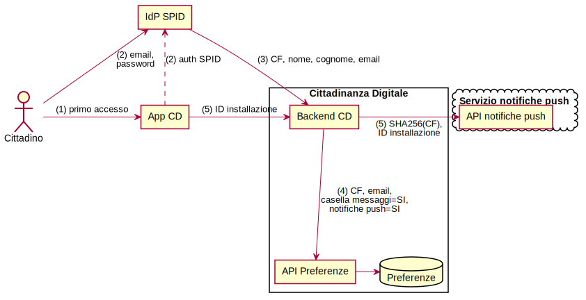

[^sha256]: <https://en.wikipedia.org/wiki/SHA-2>

[^hash-notification-hub]: Le notifiche push sono inviate ad un servizio esterno (Azure Notification Hub) che mantiene l'associazione tra l'installazione dell'app e il cittadino - è stato deciso di utilizzare la hash del CF come identificativo per evitare di salvare i CF dei cittadini su un sistema esterno.

### Lettura delle preferenze condivise da parte dell'ente

Come descritto nella Tabella \vref{tabella-preferenze}, alcune preferenze vengono
definite _condivise_, essendo condivise con gli Enti che ne fanno richiesta.
Queste preferenze non contengono informazioni personali o sensibili ma sono
assimilabili a semplici indicazioni che il cittadino vuole condividere con gli
enti per essere usate come base per la personalizzazione dei servizi digitali.

Un servizio digitale fornito dall'ente al cittadino può interrogare le preferenze
condivise del cittadino sulla base del codice fiscale dello stesso e usare
le informazioni ottenute per fornire un servizio personalizzato, ad esempio
traducendo l'interfaccia utente del servizio fornito al cittadino sulla base
della preferenza di lingua.

La funzione Preferenze può inoltre essere utilizzata dal servizio dell'ente
per sapere se il cittadino non intende ricevere comunicazioni dal servizio (_opt-out_).
Questa verifica è richiesta all'ente, prima dell'invio di una comunicazione
al cittadino attraverso la funzione _Messaggi_, secondo lo schema in Tabella
\vref{table-verifica-optout}.

Table: Verifica da parte del servizio del permesso di comunicare col cittadino.\label{table-verifica-optout}

Citt. iscritto a CD?      Opt-out al servizio?      Servizio può inviare messaggio?
--------------------      ---------------------     --------------------------------
NO                        /                         NO
SI                        NO                        **SI**
SI                        SI                        NO

\pagebreak

## Funzionalità Messaggi

La funzionalità _Messaggi_ fornisce il servizio che permette agli Enti Erogatori
di inviare comunicazioni di cortesia e avvisi di pagamento ai cittadini.

Le comunicazioni di cortesia sono sempre inviate ad uno specifico cittadino
(identificato tramite CF) e scaturiscono da una pregressa
relazione individuale tra l'Ente e il cittadino. Da queste comunicazioni sono
quindi escluse comunicazioni non personali (_broadcast_).

Si veda l'allegato
tecnico per alcuni esempi di tipologie di messaggi coperte
da questo servizio (Tabella \vref{tabella-esempi-messaggi}).

Quando l'Ente Erogatore invia un messaggio, comunica a CD i seguenti dati:

* **Identificativo del servizio** che ha generato il messaggio (es. servizio
  anagrafe).
* **Codice Fiscale** del cittadino a cui recapitare il messaggio.
* **Oggetto** del messaggio.
* **Contenuto** del messaggio.
* **Data di scadenza** associata al messaggio (opzionale, nel caso si tratti di una scadenza).
* **Identificativo Unico di Versamento** (opzionale, nel caso si tratti di un
  avviso di pagamento).

Una volta ricevute queste informazioni, il servizio Messaggi di CD esegue delle
logiche di gestione del dato che variano a seconda della tipologia di messaggio
e della configurazione delle preferenze del cittadino a cui è indirizzato lo
stesso.

Possiamo classificare i possibili scenari in due macro gruppi:

1. La gestione del messaggio quando il cittadino destinatario NON ha ancora
   effettuato il primo accesso all'applicazione di CD;
1. La gestione del messaggio quando il cittadino destinatario ha già
   effettuato il primo accesso all'applicazione di CD.

Questa distinzione è importante poichè quando il cittadino non ha ancora
effettuato il primo accesso all'applicazione di CD, non esiste ancora un suo
profilo nel sistema ed il messaggio non può essere recapitato.

### Invio di messaggi a cittadini senza un profilo CD {#invio-messaggio-noprofilo}

Per escludere questo scenario[^messaggio-ignorato], prima di inviare una comunicazione al cittadino tramite la funzionalità
Messaggi, il servizio è tenuto a verificare la disponibilità del cittadino a
ricevere la comunicazione (come descritto precedentemente nella Tabella
\vref{table-verifica-optout}).

[^messaggio-ignorato]: Nel caso in cui il servizio non effettuasse questo controllo ed invierebbe comunque il messaggio alle API di CD, il messaggio verrebbe ignorato.

### Invio di messaggi a cittadini con un profilo CD {#invio-messaggio-profilo}

Quando il cittadino accede per la prima volta, attraverso SPID, all'app di CD,
viene creato un _profilo di preferenze_ associato al codice fiscale del
cittadino (§ \vref{scenario-creazione-profilo}). Gli scenari seguenti assumono
quindi l'esistenza di un profilo contente le preferenze del cittadino.

Il _profilo di preferenze_ contiene le preferenze espresse dal cittadino
relative alle modalità (canali) con cui vuole essere contattato da uno
specifico servizio erogato dall'Ente quando questo invia un messaggio.

Le preferenze legate all'invio dei messaggi da parte dei servizi mittenti
hanno un significato di _opt-out_, ovvero sono abilitate di _default_ e il
cittadino può decidere di disabilitarle. Il cittadino può quindi esprimere una preferenza di _opt-out_ per uno specifico servizio, relativamente ad uno specifico canale di comunicazione o per tutti i canali di comunicazione.

I seguenti scenari non sono mutuamente esclusivi e possono concretizzarsi
contemporaneamente all'invio di un messaggio, a seconda delle preferenze
espresse dal cittadino.

A tutti gli scenari viene applicato un filtro alla ricezione del messaggio che
verifica che il servizio mittente sia stato abilitato dal cittadino (preferenza
_Servizi abilitati_). Nel caso in cui il servizio non sia stato abilitato dal
cittadino, il messaggio viene ignorato.

#### Scenario in cui il cittadino ha abilitato la casella dei messaggi

La _casella dei messaggi_ (o _inbox_) è un database che archivia
i messaggi inviati dagli enti al cittadino stesso. Un messaggio archiviato nella casella dei messaggi contiene i seguenti dati:

* **Identificativo del servizio** mittente del messaggio.
* **Oggetto** del messaggio.
* **Contenuto** del messaggio.
* **Data di scadenza** associata al messaggio (opzionale).
* **Identificativo Unico di Versamento** (opzionale).

All'invio di un messaggio da parte dell'ente avvengono i
seguenti passaggi (Figura \vref{figura-messaggio-profile-inbox}):

1. Il servizio dell'ente invia al servizio _Messaggi_ un messaggio associato al
   codice fiscale del cittadino.
2. Il servizio _Messaggi_ recupera le preferenze del cittadino destinatario.
3. Tra le preferenze troverà l'abilitazione della casella dei messaggi e
   procederà quindi a salvare il contenuto del messaggio nella casella dei messaggi del cittadino.
4. Quando il cittadino apre l'app nella schermata dei Messaggi, l'app farà una
   richiesta per ottenere il contenuto della casella dei messaggi al backend dell'app.
5. Il backend dell'app farà a sua volta una richiesta al servizio Messaggi,
   ottenendo il contenuto della casella dei messaggi.
6. Il cittadino visualizza il contenuto dei messaggi nell'app.

Si noti che i passi 1-3 e i passi 4-6 possono avvenire in momenti diversi (l'ente invia un messaggio al cittadino, che lo visualizza dopo qualche ora o giorni).

Infine, la preferenza relativa alla _casella dei messaggi_ ha priorità sugli
altri canali (_email_ e _notifiche push_), ovvero se la casella dei messaggi
viene disabilitata per uno specifico servizio, verranno disabilitati anche gli altri canali.

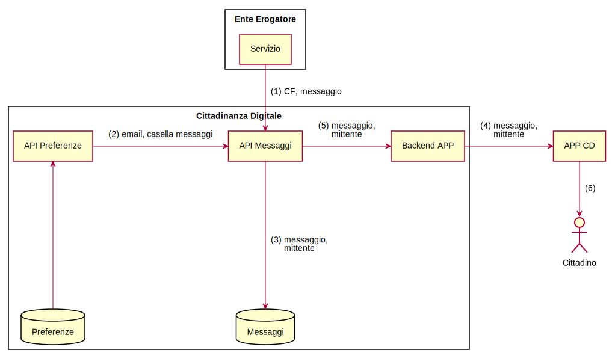

#### Scenario in cui il cittadino ha abilitato l'invio di email

Nel caso in cui il cittadino abbia abilitato il canale email nelle
proprie preferenze, avvengono i seguenti passaggi
(Figura \vref{figura-messaggio-profile-email}):

1. Il servizio dell'ente invia al servizio messaggi un messaggio associato al
   codice fiscale del cittadino.
2. Il servizio messaggi recupera le preferenze del cittadino destinatario,
   tra le quali troverà l'abilitazione alla notifica via email con
   associato l'indirizzo email su cui il cittadino vuole essere contattato.
3. Il servizio Messaggi invia il messaggio all'indirizzo email tramite uno dei
   servizi di invio email transazionale a disposizione.
4. Il servizio di invio email transazionali recapita il messaggio nella casella
   di posta elettronica del cittadino.
5. Il cittadino visualizza il contenuto del messaggi nel suo client di posta
   elettronica.

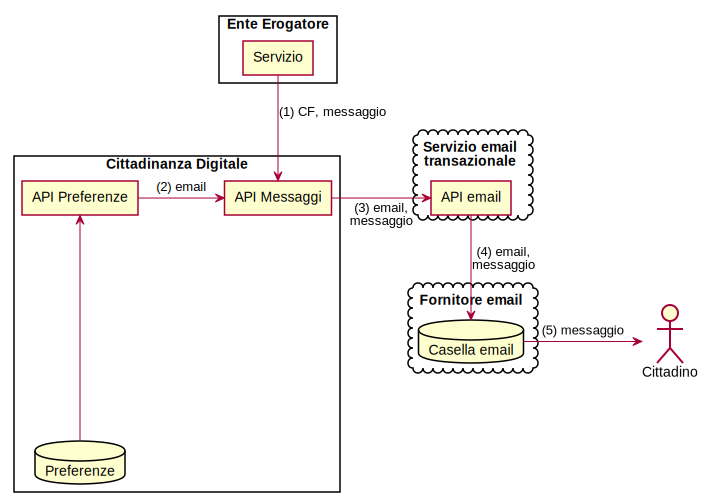

#### Scenario in cui il cittadino ha abilitato l'invio di notifiche push all'app

Nel caso in cui il cittadino abbia abilitato l'invio di notifiche push nelle
proprie preferenze, avvengono i seguenti passaggi
(Figura \vref{figura-messaggio-profile-push}):

1. Il servizio dell'ente invia al servizio messaggi un messaggio associato al
   codice fiscale del cittadino.
2. Il servizio messaggi recupera le preferenze del cittadino destinatario.
3. Tra le preferenze troverà l'abilitazione della casella dei messaggi e delle
   notifiche push[^preferenze-notifiche-casella] e procederà quindi a salvare
   il contenuto del messaggio nel database dei messaggi.
4. Il servizio Messaggi invierà una notifica al backend dell'app, avvertendolo
   che è necessario inviare una notifica push all'app perché un nuovo messaggio
   è disponibile nella casella dei messaggi.
5. Il backend dell'app istruisce il servizio di invio di notifiche push ad
   inviare una notifica push all'app associata alla hash del codice fiscale.[^notifica-hash-cf]
6. Il servizio di notifica push invia una notifica all'app.[^notifica-ios-android]
7. Alla ricezione della notifica, quando il cittadino apre l'app, l'app farà una
   richiesta per ottenere il contenuto dei messaggi al backend dell'app. Il backend dell'app farà a sua volta una richiesta al servizio Messaggi,
   ottenendo il contenuto dei messaggi ed il relativo mittente.
8. Il cittadino visualizza il contenuto dei messaggi nell'app.

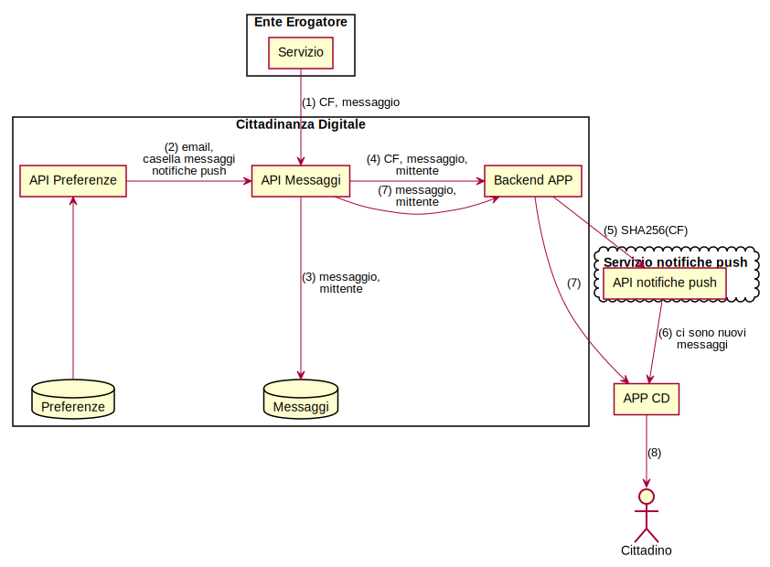

[^preferenze-notifiche-casella]: L'invio delle notifiche push sull'app richiede che sia abilitata la casella dei messaggi, per permettere all'app di recuperare il contenuto del messaggio (che non viene inviato tramite la notifica push).

[^notifica-hash-cf]: Utilizziamo la hash del codice fiscale in modo che il dato in chiaro del codice fiscale del cittadino non venga salvato nel database del servizio di invio notifiche push (in questo modo il codice fiscale viene pseudoanonimizzato).

[^notifica-ios-android]: La notifica viene inoltrata ai servizi di notifica di Google o di Apple a seconda della tipologia di device su cui è stata installata l'app.

\pagebreak

## Funzionalità Portafoglio

La funzionalità _Portafoglio_ fornisce la possibilità di pagare tributi tramite
gli strumenti di pagamento forniti da pagoPA.

Nel contesto delle funzionalità di pagamento, consideriamo due macro flussi:

1. La gestione preferenze di pagamento del cittadino (es. aggiunta di una carta
di credito).
1. Il flusso di pagamento (es. da un avviso di pagamento digitale).

### Gestione preferenze di pagamento

Il flusso di pagamento prevede che il cittadino abbia preimpostati nel suo
portafoglio dei metodi di pagamento validi (es. carta di credito) da poter
utilizzare per effettuare il pagamento del tributo.

Attualmente la funzionalità portafoglio è progettata per gestire pagamenti
tramite carta di credito.

Le informazioni sui metodi di pagamento vengono gestite attraverso la componente
_Wallet_ di PagoPA che si occupa della gestione sicura delle informazioni
sensibili (es. dati della carta di credito).

#### Inserimento dati della carta di credito

L'inserimento dei dati della carta dicredito nell'app avviene attraverso una
componente applicativa (SDK) fornita e certificata da SIA SpA che permette di
presentare all'utente una form di inserimento, che comunica in modo sicuro
con il Wallet di PagoPA. I dati della carta di credito inseriti dall'utente
vengono inviati direttamente al sistema PagoPA senza passare dal sistema di CD.

Una volta salvati, i dati della carta di credito vengono associati ad un
identificativo numerico distinto dal numero di carta di credito
(detto _identificativo dello strumento di pagamento_).

L'identificativo dello strumento di pagamento viene fornito all'app e utilizzato
nella scelta del metodo di pagamento durante il flusso di pagamento.

#### Riconciliazione profilo CD e profilo pagoPA

Le preferenze di pagamento gestite dal Wallet di PagoPA vengono associate ad
un indirizzo email, si richiede quindi un meccanismo di riconciliazione tra
i profili dei cittadini registrati sul Wallet e i cittadini che accedono
all'app di CD.

Questo meccanismo di riconciliazione si basa sulla comparazione dell'indirizzo email fornito
dal cittadino attraverso il suo profilo SPID.

Si delineano quindi due scenari in base alla presenza o meno di un profilo
nel Wallet di PagoPA corrispondente all'email associata all'account SPID
del cittadino.

##### Profilo Wallet presente

Nel caso sia presente nel Wallet, un profilo associato all'email del cittadino,
le interazioni con il Wallet attraverso l'app verranno registrate esattamente
come se avvenissero da una qualsiasi app che integra l'SDK di PagoPA.

Questo meccanismo permette al cittadino di riutilizzare il suo profilo PagoPA
dall'app CD in modo totalmente trasparente.

##### Profilo Wallet non presente

Nel caso non sia presente nel Wallet, un profilo associato all'email del cittadino,
il Wallet provvederà a creare un nuovo profilo
all'inserimento del primo metodo di pagamento. Tutte le operazioni successive
ricadono nel caso precedente.

### Pagamento

Il flusso di pagamento può scaturire da un avviso di pagamento digitale
(ricevuto quindi attraverso la funzionalità Messaggi) o da un avviso di
pagamento cartaceo (che fornisce un codice di pagamento numerico o tramite
un QR code).

#### Avvisi di pagamento digitali {#avvisi-pagamento-digitali}

Per l'invio di un avviso di pagamento digitale ad un cittadino da parte di un
servizio, viene usato il meccanismo dell'invio di un messaggio tramite l'API
Messaggi di CD (§ \ref{invio-messaggio-profilo}). In questo caso, oltre
all'oggetto ed al contenuto del messaggio vengono forniti dal servizio:

* **Numero Avviso**: si tratta di un codice numerico che identifica
  univocamente la posizione debitoria presso l'ente. [^pagopa-numero-avviso]
* **Ammontare**: l'ammontare della posizione debitoria in centesimi di Euro.[^nota-ammontare-attualizzare]

[^pagopa-numero-avviso]: Il numero avviso segue il formato
  `<cifra ausiliaria (1n)>[<codice applicativo> (2n)]<codice IUV (15|17n)>` -
  riferimento: <https://pagopa-specifichepagamenti.readthedocs.io/it/latest/_docs/Capitolo7.html>
[^nota-ammontare-attualizzare]: L'ammontare viene visualizzato all'interno
  dell'applicazione di CD insieme al messaggio e viene successivamente
  attualizzato all'atto del pagamento (§ \ref{pagopa-verifica-attualizzazione}).

#### Avvisi di pagamento cartaceo

Per quanto riguarda il pagamento di avvisi di pagamento cartacei, il cittadino
potrà effettuare il pagamento leggendo il codice QR [^avviso-codice-qr] stampato sull'avviso o
inserendo manualmente il Numero Avviso stampato anch'esso sull'avviso.

[^avviso-codice-qr]: Il codice QR stampato sull'avviso contiene il Numero Avviso.

#### Verifica e attualizzazione{#pagopa-verifica-attualizzazione}

Il flusso di verifica ed attualizzazione dell'avviso di pagamento viene iniziato
dall'app ogni volta che viene presentato l'ammontare attualizzato corrispondente
all'avviso di pagamento (tipicamente questo avviene come primo passo del
flusso di pagamento di un avviso).

Questo flusso prevede l'interazione con il nodo PagoPA attraverso il backend
dell'app secondo il diagramma in Figura \vref{figura-flusso-pagopa-verifica}.

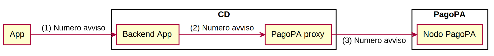

#### Transazione

Il flusso di pagamento viene iniziato dall'app ed è composto da due fasi
distinte (Figura \vref{figura-flusso-pagopa-attiva}):

* Passi 1-3: l'app interagisce con il nodo PagoPA attraverso il backend per ottenere
  l'identificativo di pagamento associato all'avviso di pagamento.
* Passo 4: l'app interagisce con il Wallet per eseguire la transazione di pagamento
  a partire dall'identificativo ottenuto al passo precedente.

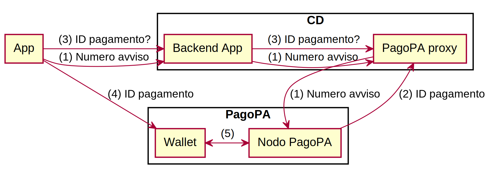

#### Ricevuta di pagamento

Dopo che la transazione di pagamento dell'avviso viene ricevuta dal Wallet,
l'app interagisce nuovamente con il Wallet per recuperare lo storico delle
transazioni. Lo storico conterrà l'esito della transazione appena eseguita,
sotto forma di ricevuta di pagamento da presentare al cittadino.

\pagebreak

# Processo di analisi

<!--
**TODO**
Explain what practical steps you will take to ensure that you identify and address privacy risks.
Who should be consulted, internally and externally?
How will you carry out the consultation?
You should link this to the relevant stages of your project management process.
Consultation can be used at any stage of the PIA process.
-->

Nel processo di analisi, andiamo a valutare il rischio per le persone fisiche,
(nel nostro caso i cittadini destinatari delle comunicazioni da parte degli
Enti Erogatori di servizi).

Altri rischi che si applicano all'organizzazione, ma che non incidono sulla
privacy, sono fuori portata. Ciò che è nel campo di applicazione di questa
analisi sono i rischi che potrebbero comportare danni fisici, materiali o
immateriali all'interessato, comprese eventuali discriminazioni, danni alla
reputazione, perdita di riservatezza dei dati protetti dal segreto professionale
o qualsiasi altro significativo svantaggio economico o sociale.

Nella nostra analisi, tutti i rischi sono associati ad una **probabilità**:

Probabile
  ~ Forte (alta) possibilità che lo scenario documentato possa
  verificarsi. Di tanto in tanto si verificano rischi elevati, ad esempio guasti
  alle apparecchiature in una situazione in cui non è prevista alcuna ridondanza.

Possibile
  ~ Possibilità media (neutra) che lo scenario documentato possa verificarsi.

Improbabile
  ~ Lo scenario è improbabile - non dovrebbe accadere più spesso di
  una volta in un decennio o meno.

Infine rischi sono anche associati ad un livello di **gravità**:

Critica
  ~ Vi è un danno significativo e reale a un gran numero di soggetti dei dati,
  ad esempio una violazione dei dati su larga scala.

Grave
  ~ Vi è un danno significativo e reale a uno o un numero limitato di soggetti
  dei dati o un danno minore a un gran numero di soggetti dei dati.

Moderata
  ~ Problema minore o procedurale che non comporta danni significativi.

\pagebreak

# Analisi dei rischi legati ai dati personali

<!--

**TODO**
Identify the key privacy risks and the associated compliance and corporate risks.

Record the risks to individuals, including possible intrusions on privacy where appropriate.

1. Assess the corporate risks, including regulatory action, reputational damage, and loss of public trust.
1. Conduct a compliance check against the Data Protection Act and other relevant legislation.
1. Maintain a record of the identified risks.
1. The process helps an organisation to understand the likelihood
   and severity of privacy risks.
1. An organisation is open with itself about risks and potential changes to a project.
-->

Prima di analizzare i rischi in dettaglio, dobbiamo considerare i possibili
scenari di rischio alla privacy dal punto di vista del soggetto interessato.

Di seguito elenchiamo i possibili scenari, raggruppati per tipologia:

* Violazione di riservatezza e integrità:
  * Divulgazione di dati personali: un cittadino considererà le informazioni
    trasmesse dagli Enti Erogatori come confidenziali e potrebbe essere in
    difficoltà o subire danni alla reputazione se le informazioni
    trapelassero impropriamente.
  * Integrità dei dati personali: una cittadino sarebbe preoccupato se ricevesse
    informazioni destinate ad un altro cittadino o se le informazioni indirizzate
    a lui venissero modificate in modo improprio o errato.
* Perdita o non disponibilità di dati personali:
  * Perdita di dati personali: se un cittadino ricevesse delle informazioni da un
    Ente e successivamente queste informazioni andassero perse, il cittadino
    perderebbe fiducia nel servizio. Il cittadino sarebbe preoccupato che le
    informazioni che gli Enti Erogatori gli inviano siano archiviate in modo
    sicuro per tutto il tempo necessario.
* Impossibilità di esercitare i diritti secondo la legge sulla protezione dei dati personali:
  * Mancanza di capacità di esercitare i diritti previsti dalla legge sulla
    protezione dei dati: una persona interessata ha molti diritti in base alla
    legge sulla protezione dei dati e potrebbe essere preoccupata per esempio di
    non essere in grado di ottenere copie dei propri dati personali.
* Incorretta identificazione dei soggetti coinvolti nella trasmissione di dati personali:
  * Qualcuno effettua un pagamenti per una posizioni debitorie di cui non è
    responsabile: ...
  * Qualcuno invia una comunicazione per conto di un servizio: ...

Le seguenti sezioni trattano i rischi relativi a questi scenari.

<!--
### (Oggetto)

Possibile ● Grave

**Natura del rischio**

**TODO**

**Misure atte a mitigare o prevenire il rischio**

**TODO**

**Efficacia delle misure**

is the risk eliminated, reduced, or accepted?

**Stato di approvazione e implementazione**

**TODO**

-->

## Rischi legati alla violazione di riservatezza e integrità di dati personali

Rischio                                 Probabilità   Gravità   Misure
--------                                ------------  --------  -------
\ref{r-intercettazione-api-gw-cd}       Possibile     Grave     Si
\ref{r-intercettazione-be-pagopa}       Probabile     Critica   Si
\ref{r-accesso-fisico}                  Improbabile   Critica   Si
\ref{r-vulnerabilita}                   Improbabile   Critica   Si
\ref{r-account-compromise}              Possibile     Critica   No

### Intercettazione della trasmissione tra le componenti esterne ed interne {#r-intercettazione-api-gw-cd}

**Natura del rischio**

Durante la trasmissione dei messaggi indirizzati ad un cittadino da parte
degli Enti Erogatori verso le API di CD, vi è la possibilità che il contenuto
della trasmissione possa essere intercettato tramite tecniche di intercettazione
passiva (_sniffing_[^sniffing]) o attacchi di tipo _man in the middle_.[^man-in-the-middle]

[^sniffing]: <https://it.wikipedia.org/wiki/Sniffing>

[^man-in-the-middle]: <https://it.wikipedia.org/wiki/Attacco_man_in_the_middle>

**Misure atte a mitigare o prevenire il rischio**

Tutte le trasmissioni tra le componenti esterne e interne di Cittadinanza Digitale
vengono criptate con il protocollo di trasporto di dati TLS 1.0 o superiore.[^transport-layer-security]

[^transport-layer-security]: <https://it.wikipedia.org/wiki/Transport_Layer_Security>

**Efficacia delle misure**

Il rischio è stato eliminato.

**Stato di approvazione e implementazione**

Il protocollo TLS è implementato:

* nelle trasmissioni verso l'API Gateway
* nelle trasmissioni verso il backend dell'app
* nelle trasmissioni verso il Wallet PagoPA

Si faccia riferimento al diagramma architetturale in figura \vref{figura-infrastruttura-rete}.

### Intercettazione della trasmissione tra il backend dell'app e il nodo PagoPA {#r-intercettazione-be-pagopa}

**Natura del rischio**

La medesima del rischio § \vref{r-intercettazione-api-gw-cd}.

**Misure atte a mitigare o prevenire il rischio**

Il backend dell'app e il nodo PagoPA comunicano attraverso un collegamento VPN
punto-punto criptato con le migliori pratiche di sicurezza[^vpn-pagopa] (Figura \vref{figura-infrastruttura-rete}).

[^vpn-pagopa]: algoritmo AES-256, chiave a 1024 bit, controllo d'integrità tramite hash SHA256 e _perfect forward secrecy_.

**Efficacia delle misure**

Il rischio è stato eliminato.

**Stato di approvazione e implementazione**

Il collegamento VPN è attualmente attivo.

### Accesso fisico ai dati archiviati nei server di Cittadinanza Digitale {#r-accesso-fisico}

**Natura del rischio**

Un attore malevolo che abbia accesso fisico ai server di Cittadinanza Digitale
dove risiedono i dati personali dei cittadini avrebbe la possibilità di
estrarre i dati dai server, provocando un _data breach_.

**Misure atte a mitigare o prevenire il rischio**

Il software applicativo di backend di Cittadinanza Digitale viene eseguito su
infrastruttura cloud Microsoft Azure.

Tutti i datacenter Microsoft Azure implementano meccanismi di controllo della
sicurezza allo stato dell'arte: sorveglianza 24x7x365, protezioni ambientali e
perimetrali e policy di accesso estese a tutto il personale.

Per maggiori dettagli si faccia riferimento al documento
_Microsoft Azure Security Overview_. [^azure-security-overview]

[^azure-security-overview]: <http://go.microsoft.com/?linkid=9740388>

**Efficacia delle misure**

Il rischio è stato ridotto.

**Stato di approvazione e implementazione**

Il software applicativo ed i dati sono attualmente ospitati nell'infrastruttura
cloud Microsoft Azure.

### Sfruttamento di vulnerabilità o malware per estrarre dati personali (_data breach_) {#r-vulnerabilita}

**Natura del rischio**

Vulnerabilità software, sistemi non aggiornati o malware possono essere sfruttati
da un attore malevolo per ottenere un accesso non autorizzato ai sistemi ed
estrarre dati personali di molti utenti (_data breach_).

**Misure atte a mitigare o prevenire il rischio**

Vengono adottati dei meccanismi di verifica automatizzata di potenziali vulnerabilità all'interno delle componenti software di CD e all'interno del codice delle librerie di terze parti utilizzate dalle componenti.

Queste verifiche, effettuate automaticamente ad ogni modifica del codice applicativo ed ad ogni aggiornamento delle librerie, vengono effettuate tramite una serie di strumenti quali:

1. **Node Security**[^nodesecurity]: servizio di rilevamento automatico di vulnerabilità nelle librerie;
1. **Code Climate**[^codeclimate]: servizio di _review_ del codice automatizzato che rileva problematiche di sicurezza e stabilità nel codice prodotto;
1. **Codacy**[^codacy]: servizio di _review_ del codice automatizzato che rileva problematiche di sicurezza e stabilità nel codice prodotto;

Inoltre, sempre tramite un sistema automatizzato (_DependaBot_[^dependabot]), tutte le liberie esterne vengono tenute costantemente aggiornate per minimizzare la possibilità che contengono vulnerabilità.

Infine vengono pianificati ed effettuati dei penetration test periodici per far emergere eventuali problematiche di sicurezza a livello di sistema e a livello applicativo.

[^nodesecurity]: <https://nodesecurity.io/>
[^codeclimate]: <https://codeclimate.com/>
[^codacy]: <https://www.codacy.com/>
[^dependabot]: <https://dependabot.com/>

**Efficacia delle misure**

Il rischio è stato ridotto.

**Stato di approvazione e implementazione**

Le misure sono attualmente implementate.

### Un account amministrativo dell'infrastruttura viene compromesso {#r-account-compromise}

**Natura del rischio**

Le credenziali di un account di administratore vengono compromesse (rivelate
tramite forza bruta o ottenute con un attacco di phishing), garantendo
l'accesso ai dati di tutti i cittadini presenti nell'infrastruttura applicativa.

**Misure atte a mitigare o prevenire il rischio**

Per ridurre il rischio di una compromissione delle credenziali di accesso alle
risorse cloud, vengono intraprese le seguenti misure:

1. Adeguato addestramento del personale su sicurezza e attacchi di phishing.
1. Limitazione dell'accesso alle risorse e dati delle singole credenziali al minimo indispensabile.
1. Abilitazione dell'autenticazione multi-fattore basata su token.[^no-2fa-sms]

[^no-2fa-sms]: L'autenticazione multifattore basata su token è ritenuta più sicura dell'autenticazione basata su SMS: <https://www.schneier.com/blog/archives/2016/08/nist_is_no_long.html>.

**Efficacia delle misure**

Il rischio è ridotto.

**Stato di approvazione e implementazione**

Le misure sono in fase di implementazione.

\pagebreak

## Rischi legati alla perdita o non disponibilità di dati personali

Rischio                                 Probabilità   Gravità   Misure
--------                                ------------  --------  -------
\ref{r-data-loss}                       Improbabile   Grave     Parziali
\ref{r-interruption}                    Probabile     Moderata  Parziali

### Perdita parziale o totale dei dati archiviati {#r-data-loss}

**Natura del rischio**

A causa di problemi all'hardware o al software dell'infrastruttura applicativa
una porzione di dati personali potrebbe andare persa, in particolare:

* Preferenze del cittadino
* Messaggi ricevuti dalle pubbliche amministrazioni

**Misure atte a mitigare o prevenire il rischio**

Per ovviare a problematiche relative alla perdita dei dati causata da errori
sulle componenti di archiviazione, è stato implementato un meccanismo di
_storage_ dei dati ridondato geograficamente su due _datacenter_.

Per quanto riguarda invece eventuali problematiche software, vengono implementati meccanismi di backup automatizzato.

**Efficacia delle misure**

Il rischio è stato eliminato.

**Stato di approvazione e implementazione**

Misure in fase di implementazione.

### Problemi software o di rete hanno l'effetto di interrompere o annullare le operazioni {#r-interruption}

**Natura del rischio**

Delle problematiche che possono sorgere durante un operazione effettuata dal
cittadino o dall'Ente (es. guasto hardware, interruzioni di rete, guasto software) possono
generare una perdita o una corruzione totale o parziale dei dati in transito e
la conseguente interruzione dell'operazione, costringendo il cittadino o l'Ente
a ripetere l'operazione.

**Misure atte a mitigare o prevenire il rischio**

Nel codice applicativo vengono implementati meccanismi di _retry_ su interfaccia idempotente, garantendo che ogni operazione venga eseguita correttamente, entro un tempo definito, anche in presenza di problemi di rete o hardware.

**Efficacia delle misure**

Il rischio è stato eliminato.

**Stato di approvazione e implementazione**

Implementazione completata.

\pagebreak

## Rischi legati all'incorretta identificazione dei soggetti coinvolti nella trasmissione di dati personali

Rischio                                 Probabilità   Gravità   Misure
--------                                ------------  --------  -------
\ref{r-service-id}                      Possibile     Critica   Parziali
\ref{r-api-id}                          Possibile     Critica   Parziali
\ref{r-cit-id}                          Possibile     Grave     Parziali

### Un attore malevolo impersona un Ente inviando illecitamente dati ai cittadini o accedendo ai messaggi inviati dall'Ente {#r-service-id}

**Natura del rischio**

Le credenziali che permettono all'ente di inviare messaggi ai cittadini devono essere conservate in modo sicuro poiché queste credenziali permettono a chiunque, potenzialmente, di identificarsi come servizio.

**Misure atte a mitigare o prevenire il rischio**

Per l'imitare l'impatto sulla privacy in caso di compromissione delle
credenziali dell'Ente, vengono implementati:

* Meccanismo di cifratura _end-to-end_ dei messaggi per prevenire la lettura del messaggi precedentemente inviati ad un cittadino.
* Restrizione sugli indirizzi IP che possono effettuare chiamate alle API di CD con le credenziali dell'Ente, per prevenire che un terzo attore, anche in possesso delle credenziali, possa inviare messaggi per conto dell'Ente.

**Efficacia delle misure**

Il rischio è stato ridotto.

**Stato di approvazione e implementazione**

Misure in fase di implementazione.

### Un attore malevolo impersona le API di CD, intercettando i dati personali dei cittadini {#r-api-id}

**Natura del rischio**

Tramite la compromisssione dell'infrastruttura di rete dell'Ente, è potenzialmente possibile implementare un attacco di tipo _man in the middle_[^attacco-mitm] che permette di intercettare i messaggi che l'Ente invia al sistema di CD.

[^attacco-mitm]: <https://it.wikipedia.org/wiki/Attacco_man_in_the_middle>

**Misure atte a mitigare o prevenire il rischio**

Tramite verifica dei certificati del server API di CD da parte dell'Ente, l'Ente è sicuro di comunicare con le API di CD, escludendo possibile attacchi di _man in the middle_.

**Efficacia delle misure**

Rischio è stato eliminato.

**Stato di approvazione e implementazione**

Misure in fase di implementazione.

### Un attore malevolo impersona un cittadino accedendo ai suoi dati personali e compie operazioni a suo nome {#r-cit-id}

**Natura del rischio**

Questo tipo di attacco è legato al meccanismo di autenticazione SPID.

Se un attore malevolo riesce ad impersonare un cittadino, potrà:

* accedere a tutti i dati personali, email e preferenze del cittadino
* accedere a tutti i messaggi ricevuti dal cittadino
* effettuare pagamenti di avvisi (anche non indirizzati al cittadino) usando gli
  strumenti di pagamento salvato dal cittadino

**Misure atte a mitigare o prevenire il rischio**

Per minimizzare il rischio di compromissione delle credenziali SPID, all'interno dell'app di CD viene utilizzato un secondo fattore di autenticazione sotto forma di codice personale identificativo (PIN), o ove possibile anche tramite autenticazione biometrica fornita dallo smartphone.

**Efficacia delle misure**

Il rischio è stato ridotto.

**Stato di approvazione e implementazione**

Misure in fase di implementazione.

\pagebreak

## Rischi legati all'impossibilità di esercitare i diritti secondo la legge sulla protezione dei dati personali

Rischio                                 Probabilità   Gravità   Misure
--------                                ------------  --------  -------
\ref{r-cit-data}                        Improbabile   Moderata  Parziali
\ref{r-processor-gdpr}                  Improbabile   Moderata  Parziali
\ref{r-data-retention}                  Improbabile   Moderata  Parziali

### Un cittadino non ha accesso a tutti i dati che CD ha raccolto su di lui {#r-cit-data}

**Natura del rischio**

Se il cittadino non ha accesso completo a tutte le informazioni relative ad esso e gestite dal sistema di CD, egli non può esercitare i propri diritti di privacy secondo le norme di legge.

**Misure atte a mitigare o prevenire il rischio**

Grazie ad un pannello di controllo personale, il cittadino può verificare tutte le informazioni personali che il sistema CD ha in suo possesso ed ha inoltre la possibilità di ottenerne una copia ed eliminarle dal sistema.

**Efficacia delle misure**

Il rischio è stato eliminato.

**Stato di approvazione e implementazione**

Misure in fase di implementazione.

### I dati personali sono elaborati da entità non GDPR-compliant {#r-processor-gdpr}

**Natura del rischio**

Il sistema CD, per via della sua complessità, utilizza componenti di terze parti e servizi esterni per implementare alcune delle funzionalità fornite al cittadino.

Alcune informazioni personali potrebbero dover essere elaborate da questi servizi di terzi ed è necessario che anche questi servizi terzi seguino le direttive GDPR per garantire la protezione dei dati personali del cittadino.

**Misure atte a mitigare o prevenire il rischio**

Utilizzo esclusivo di servizi terzi che siano _GDPR compliant_.

**Efficacia delle misure**

Il rischio è stato eliminato.

**Stato di approvazione e implementazione**

Implementazione completa.

### I dati personali sono archiviati oltre il tempo strettamente necessario {#r-data-retention}

**Natura del rischio**

I dati personali del cittadino forniscono una cronostoria delle sue attività e devono essere conservati per il tempo strettamente necessario all'erogazione del servizio e non oltre.

**Misure atte a mitigare o prevenire il rischio**

Viene definita una policy di _data retention_ che garantisca la conservazione dei dati per la durata minima necessaria all'erogazione del servizio.

**Efficacia delle misure**

Il rischio è stato eliminato.

**Stato di approvazione e implementazione**

Misure in fase di implementazione.

\pagebreak

# Allegato tecnico

## Esempi di comunicazioni gestibili dal servizio Messaggi {#esempi-messaggi}

Table: Esempi di messaggi personalizzati.\label{tabella-esempi-messaggi}

Ente Erogatore                Oggetto
---------------               --------
Agenzia delle Entrate         Notifiche di cortesia cartelle esattoriali
Agenzia delle Entrate         Avvisi di cortesia scadenze
Agenzia delle Entrate         Visure catastali
Agenzia delle Entrate         Pagamento spese per immobili
Agenzia delle Entrate         Accredito rimborsi
Comune                        Avviso multa
Comune                        Avviso TARI
Comune                        Avviso scadenza rette scolastiche
Comune                        Mense scolastiche
Comune                        Scadenze documenti di identità
Comune                        Scadenza tessera elettorale
Ministero dei Trasporti       Scadenza revisione
Ministero dei Trasporti       Punti patente
Ministero dei Trasporti       Scadenza patente
ACI                           Bollo Auto

## Meccanismi di autenticazione

### Autenticazione app mobile

Il cittadino viene identificato dall'app di CD attraverso una combinazione di Autenticazione SPID e codice PIN.

I passi di autenticazione all'apertura dell'app comprendono
(Figura \vref{figura-flusso-autenticazione-app}):

* Verifica di una sessione attiva e valida con il backend dell'app.
* Autenticazione SPID Livello 2.
* Verifica ed accettazione della versione più recente dei termini d'uso del servizio e delle privacy policy.
* Impostazione e successiva verifica del codice PIN.

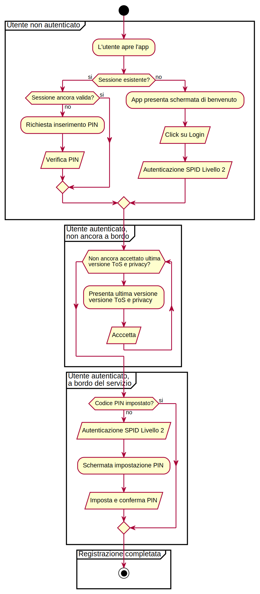

#### Autenticazione via PIN e Biometrico

Al fine di ottimizzare l'esperienza utente nell'applicazione mobile, al primo
accesso viene richiesto all'utente di impostare un codice PIN (ed opzionalmente
di configurare un codice di accesso biometrico se il dispositivo lo consente).

Nel caso in cui la sessione di autenticazione verso il backend dell'app è
ancora valida[^validita-sessione-backend], il codice PIN verrà richiesto
all'utente per sbloccare l'applicazione quando questa esce dal background.

[^validita-sessione-backend]: La durata del token di sessione è configurabile sul backend dell'app e attualmente è impostata a 30 giorni.

#### Autenticazione verso il backend dell'app {#autenticazione-app-backend}

L'app mantiene una sessione verso il backend creata al completamento con
successo dell'autenticazione SPID ma scollegata dalla sessione SPID che
l'utente stabilisce con l'Identity Provider.

Il flusso di autenticazione dell'app con il backend tramite la sessione è il
seguente:

1. L'utente inizia il processo di autenticazione SPID dall'interno dell'app.
1. Il backend da inizio al flusso di autenticazione SPID tramite l'Identity Provider (IdP)
   scelto dall'utente (Figura \vref{figura-flusso-autenticazione-app}).
1. Al termine del flusso di autenticazione SPID, il backend riceve l'asserzione
   SAML firmata dall'IdP e contente gli attributi SPID richiesti.
1. Gli attributi richiesti vengono salvati in un database locale ed associati
   al _token_ di sessione generato dal backend [^token-sessione] e condiviso con l'app.
1. L'app effettua una chiamata alle API del backend usando il _token_ di
   sessione come meccanismo di autenticazione _bearer_.[^autenticazione-bearer]
1. Il backend recupera gli attributi associati al _token_ ed esegue l'operazione
   richiesta, associandola all'utente SPID.
1. Se il _token_ risulta avere una vita superiore a quella limite, il backend
   risponderà all'app che il _token_ non è più valido e l'app chiederà
   all'utente di autenticarsi nuovamente con SPID.

[^token-sessione]: Il token di sessione è un numero casuale di 48 bytes
  generato da un algoritmo crittografico di generazione di dati pseudo-casuali -
  in particolaresi viene usata la funzione `randomBytes` della libreria `crypto`
  di Nodejs (<https://nodejs.org/api/crypto.html>).

[^autenticazione-bearer]: <https://swagger.io/docs/specification/authentication/bearer-authentication/>

#### Invalidazione delle sessioni attive

Per ottimizzare la privacy del cittadino, quando viene effettuata una nuova
autenticazione SPID dall'app e contestualmente creata una nuova sessione
(§ \ref{autenticazione-app-backend}), tutte le sessioni attive in quel momento
vengono annullate (comprese le sessioni verso il Wallet, § \ref{autenticazione-app-wallet}).

Il meccanismo di invalidazione delle sessioni dell'app, viene inoltre attivato
nel momento in cui un utente chiede la cancellazione del proprio account dalla
piattaforma CD.

### Autenticazione API CD

Tutti i servizi che interagiscono con le API di CD (inclusi i servizi forniti
dagli Enti Erogatori ed il backend dell'applicazione mobile di CD) si accreditano
sul portale degli sviluppatori di CD [^portale-dev-cd] ottenendo delle
credenziali (_chiave API_) per ogni servizio che viene registrato.
L'autenticazione delle chiamate alle API di CD
avviene quindi a livello di singolo servizio, permettendo a CD di applicare
delle policy di _throttling_ e di quota d'uso a livello di singolo servizio e,
in caso di abuso, disattivare l'accesso alle API da parte di un singolo servizio
erogato dall'ente.

L'accesso alle API di CD da parte dei servizi viene intermediato dal servizio
di _API Management_ (APIM) fornito da Azure [^apim-page] secondo il diagramma in
Figura \vref{figura-infrastruttura-apim}:

1. Il responsabile del servizio si accredita sul portale degli sviluppatori
   ricevendo la _chiave API_ per il servizio registrato. La _chiave API_ viene generata dal servizio di _API Management_ al momento della registrazione.
1. Il responsabile del servizio imposta la _chiave API_ nel servizio in modo
   che venga utilizzata per effettuare le chiamate alle API di CD.
1. Il servizio fornisce la _chiave API_ sotto forma di token di autenticazione
   _bearer_ nelle chiamate API verso l'API gateway.
1. L'API gateway valida la _chiave API_, raccogliendo l'identificativo del
   servizio associato alla chiave e i ruoli associati.
1. L'identificativo del servizio e i ruoli associati vengono passati insieme
   alla richiesta originaria alle API di CD.

L'APIM garantisce l'autenticazione di tutte le chiamate verso le API di CD e
comunica alle API di CD i ruoli associati al singolo servizio, fornendo
inoltre funzionalità di _throttling_, _rate limiting_ e _usage quota_.

Nella fase di accreditamento, ad ogni servizio vengono associati dei ruoli (Tabella \vref{table-api-roles})
che abilitano le operazioni fornite dalle API di CD. A seconda della tipologia
di servizio, possono venire associati combinazioni di ruoli diversi, e quindi
diverse funzionalità fornite dalle API di CD (Tabella \vref{table-api-service-roles}).

#### Accreditamento con ruolo di test (_sandboxed_)

Quando un servizio si accredita autonomamente sul portale delle API, riceve
inizialmente solo il ruolo `ApiLimitedMessageWrite` che gli garantisce la
possibilità di inviare messaggi ad un codice fiscale di test, generato in modo
casuale per lo specifico servizio.

Il codice fiscale di test, viene associato
all'email utilizzata in fase di registrazione del servizio, permettendo di
effetuare delle prove di invio dei messaggi (che vengono inviati all'email
utilizzata in fase di registrazione).

Una volta che l'integrazione con le API è completa e che il processo di
onboarding formale sia stato completato, il servizio viene promosso ad un
servizio _standard_, in grado di inviare messaggi a tutti i cittadini.

Table: Ruoli relativi alle API di CD che vengono associati ai servizi accreditati.\label{table-api-roles}

Ruolo                           Descrizione
------                          ------------
`ApiLimitedProfileRead`         Lettura delle preferenze di un cittadino
`ApiFullProfileRead`            Lettura profilo completo di un cittadino
`ApiProfileWrite`               Creazione/modifica profilo di un cittadino
`ApiServiceRead`                Lettura degli attributi di un servizio
`ApiServiceWrite`               Creazione/modifica di un servizio
`ApiMessageRead`                Lettura messaggio inviato dal servizio
`ApiMessageWrite`               Invio messaggio ad un cittadino
`ApiLimitedMessageWrite`        Invio messaggio ad un cittadino autorizzato
`ApiMessageWriteDefaultAddress` Invio messaggio fornendo indirizzo email
`ApiMessageList`                Lettura casella messaggi di un cittadino

Table: Conbinazione di ruoli associati alle diverse tipologie di servizi.\label{table-api-service-roles}

--------------------------------------------------
Tipologia servizio      Ruoli associati
-------------------     --------------------------
Servizio _sandboxed_    `ApiLimitedMessageWrite`
                        `ApiMessageRead`

Servizio standard       `ApiLimitedProfileRead`
                        `ApiMessageWrite`
                        `ApiMessageRead`

Portale sviluppatori    `ApiServiceRead`
                        `ApiServiceWrite`
                        `ApiMessageWrite`

Backend dell'app        `ApiFullProfileRead`
                        `ApiProfileWrite`
                        `ApiServiceRead`
                        `ApiMessageList`
--------------------------------------------------

[^portale-dev-cd]: <https://developer.cd.italia.it/>
[^apim-page]: <https://docs.microsoft.com/it-it/azure/api-management/api-management-key-concepts>

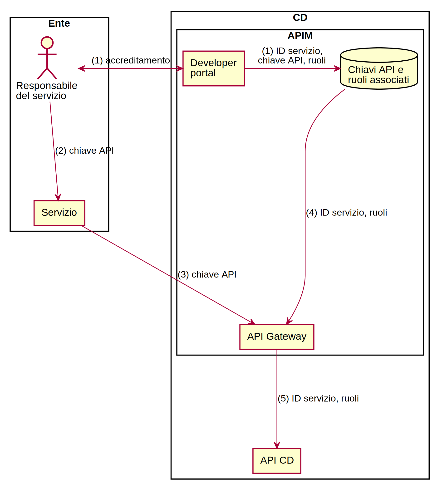

### Autenticazione pagoPA

#### Autenticazione del'app verso il Payment Manager/Wallet PagoPA {#autenticazione-app-wallet}

L'app effettua delle chiamate direttamente alle API del Payment Manager/Wallet
di PagoPA, per la gestione dei metodi di pagamento e delle transazioni.

Queste chiamate devono contenere un token di autenticazione che permetta a
PagoPA di identificare il cittadino e riconiliare la sua identitità con
l'eventuale profilo già presente nel sistema PagoPA.

Il _token_ di autenticazione del Wallet ha lo stesso formato [^token-sessione]
e segue lo stesso ciclo di vita del _token_ di autenticazione del backend
dell'app (§ \ref{autenticazione-app-backend}).

#### Autenticazione del backend dell'app verso il nodo PagoPA

Per alcuni step del flusso di verifica di una posizione debitoria e di esecuzione
della transazione di pagamento, l'applicazione mobile di CD interagisce con il
Nodo PagoPA attraverso il proprio backend, che a sua volta si appoggia ad una
componente, chiamata _pagopa-proxy_, che ha il compito di convertire ed
instradare le richieste verso il Nodo PagoPA attraverso una VPN punto-punto
(Figura \vref{figura-infrastruttura-pagopa}).

L'interazione tra _pagopa-proxy_ e il Nodo PagoPA avviene tramite il protocollo
SOAP. L'autenticazione tra le due componenti è garantita da:

* A livello di rete, garantita dalla VPN punto-punto (criptata con chiave condivisa).
* A livello applicativo, garantita da una chiave condivisa fornita nei messaggi SOAP.

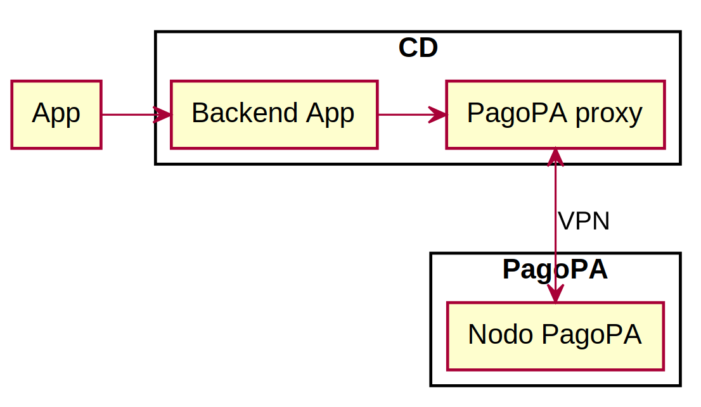

## Sicurezza

### Meccanismi di controllo dell'accesso

#### Accesso remoto ai sistemi

Le macchine virtuali che erogano i servizi della piattaforma di CD, sono
configurate per consentire l'accesso remoto tramite protocollo SSH e
autenticazione a chiave pubblica. Le macchine virtuali non sono dotate di IP
pubblico, per raggiungerle è necessario passare da un _bastion host_.[^bastion-host]

[^bastion-host]: Un _bastion host_ è un computer specializzato nell'isolare una rete locale da una connessione internet pubblica, creando uno scudo che permette di proteggere la rete locale da attacchi esterni - <https://it.wikipedia.org/wiki/Bastion_host>

#### Accesso alle risorse cloud

CosmosDB
  ~ L'accesso alle risorse _CosmosDB_ avviene tramite API REST, su protocollo HTTPS con firma HMAC derivata da un token segreto,
  generato alla creazione del database. Il token viene custodito nella configurazione applicativa delle API.[^accesso-cosmosdb]

Redis cache
  ~ L'accesso alle risorse _Redis cache_ avviene tramite protocollo Redis su trasporto TLS. Per leggere/scrivere il contenuto
  della cache è necessario fornire una password (token segreto) durante la connessione TCP. Il token è custodito
  nella configurazione applicativa del backend dell'applicazione mobile.[^accesso-redis]
  Le risorse Redis sono dispiegate su una Azure Virtual Network (VNET) che fornisce l'isolamento dalla rete pubblica.

Blob/Queue storage
  ~ Le risorse Blob/Queue Storage, che contengono il contenuto dei messaggi inviati, vengono accedute su protocollo HTTPS
  (cifratura in transito) fornendo un token segreto. Il token è custodito nella configurazione applicativa delle API.
  Tutti i dati memorizzati negli storage sono automaticamente cifrati (cifratura a riposo).[^accesso-storage]
  Le risorse Blob/Queue Storage sono dispiegate su una Azure Virtual Network (VNET) che fornisce l'isolamento dalla rete pubblica.

API gateway (Azure API management)
  ~ L'API gateway è esposto direttamente su internet, raggiungibile tramite una URL che identifica la risorsa.
  Per utilizzare le API è necessario ottenere un token (API key) dall'amministratore del sistema, durante
  la procedura di onboarding di un nuovo servizio. Il dialogo con i client avviene tramite procotollo HTTPS.
  Il dialogo con il componente Functions avviene tramite una Azure Virtual Network (VNET)[^accesso-api-gateway].

Functions
  ~ Le Azure Functions rappresentano l'ambiente "Serverless" Azure e implementano la logica applicativa delle API
  di notifica a preferenze. Vengono accedute su protocollo HTTPS, fornendo un token segreto, unicamente tramite l'API gateway.
  Il token è custodito nella configurazione applicativa dell'API gateway che si occupa di inoltrare le richieste
  provenienti dall'esterno (internet) verso le Functions dispiegate su una Azure Virtual Network (VNET),
  che fornisce quindi l'isolamento dalla rete pubblica.[^accesso-functions]

Notification Hub
  ~ L'endpoint del Notification Hub è esposto direttamente su internet.
  L'hub di notifica implementa uno schema di sicurezza denominato "firma di accesso condiviso" (SAS, Shared Access Signature).[^accesso-notification-hub]
  Il token di attivazione del Notification Hub è custodito nella configurazione applicativa del backend dell'App
  e da questo utilizzato per l'invio delle notifiche push. L'app mobile non accede pertanto direttamente alle funzionalità del Notification Hub.

Application Insights
  ~ I log applicativi vengono aggregati utilizzando Azure Application Insights.
  I log sono memorizzati in un account di archiviazione, valgono pertanto le stesse considerazioni sulla sicurezza
  summenzionate per gli Azure Blob Storage. Solo gli amministratori del sistema possono accedere al contenuto dei log,
  previo login tramite 2FA sul portale di Azure.[^accesso-application-insights]
  I componenti del sistema trasmettono i log ad AI tramite il protocollo HTTPS utilizzando un token segreto
  (_instrumentation key_) memorizzato nella configurazione applicativa di ogni componente.

[^accesso-cosmosdb]: <https://docs.microsoft.com/it-it/rest/api/cosmos-db/access-control-on-cosmosdb-resources>
[^accesso-redis]: <https://docs.microsoft.com/it-it/azure/redis-cache/cache-overview>
[^accesso-storage]: <https://docs.microsoft.com/it-it/azure/storage/common/storage-security-guide>
[^accesso-api-gateway]: <https://docs.microsoft.com/it-it/azure/api-management/api-management-using-with-vnet>
[^accesso-functions]: <https://docs.microsoft.com/it-it/azure/azure-functions/functions-overview>
[^accesso-notification-hub]: <https://docs.microsoft.com/it-it/azure/notification-hubs/notification-hubs-push-notification-security>
[^accesso-application-insights]: <https://docs.microsoft.com/it-it/azure/application-insights/app-insights-resources-roles-access-control>

#### Accesso a service provider esterni ad Azure

MailUp
  ~ Il service provider MailUp è utilizzato dalle API di notifica per l'invio delle email
  agli iscritti all'applicazione di Cittadinanza Digitale. Le credenziali per l'accesso al servizio
  (nome utente e password per l'accesso alle API) sono memorizzate nella configurazione applicativa delle Azure Functions.
  Il traporto dei messaggi inviati avviene utilizzando il protocollo HTTPS fino ai server di MailUp
  che ne effettuano il _dispatching_ tramite i server SMTP del service provider.[^accesso-mailup]
  Le credenziali per l'accesso al portale di amministrazione di MailUp sono custodite da AgID.

[^accesso-mailup]: <https://www.mailup.com/gdpr-infrastructure/>

#### Accesso alla configurazione cloud

L'accesso alla configurazione cloud Azure avviene attraverso due meccanismi:

* accesso interattivo alla dashboard Azure tramite account Microsoft (username e password)
* accesso via script di configurazione automatizzato (Terraform) tramite meccanismo _service principal_.[^azure-service-principal]

[^azure-service-principal]: <https://docs.microsoft.com/it-it/azure/azure-stack/azure-stack-create-service-principals>

I sistemi informativi AgID amministrano la sottoscrizione Azure e possiedono le credenziali
per accedere al portale di amministrazione con il massimo dei privilegi: creazione e rimozione delle risorse,
accesso in lettura e scrittura ai dati.

L'autenticazione, a due fattori, avviene tramite l'Active Directory AgID.

Gli account dei gestori della piattaforma (_contributor_, secondo la terminologia Azure)
sono anch'essi impostati nell'AD AgID e richiedono autenticazione tramite 2FA.
I _contributor_ possono accedere al portale di amministrazione e gestire in autonomia
le risorse PaaS fornite da Azure.

### Trasporto dati

**TODO**

### Verifica dell'integrità dei dati

**TODO**

## Diagrammi architetturali

Diagramma                   Figura
----------                  --------
Infrastruttura fisica       Figura \vref{figura-infrastruttura-fisica}
Infrastruttura sistema      Figura \vref{figura-infrastruttura-sistema}
Infrastruttura rete         Figura \vref{figura-infrastruttura-rete}
Infrastruttura piattaforma  Figura \vref{figura-infrastruttura-piattaforma}
Infrastruttura applicativa  Figura \vref{figura-infrastruttura-applicativa}
Infrastruttura dati         Figura \vref{figura-infrastruttura-dati}

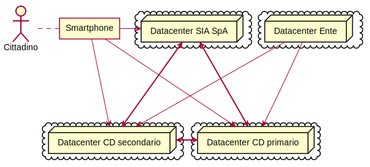

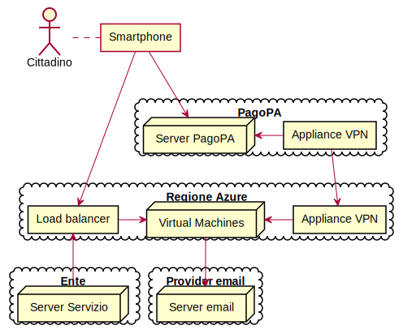

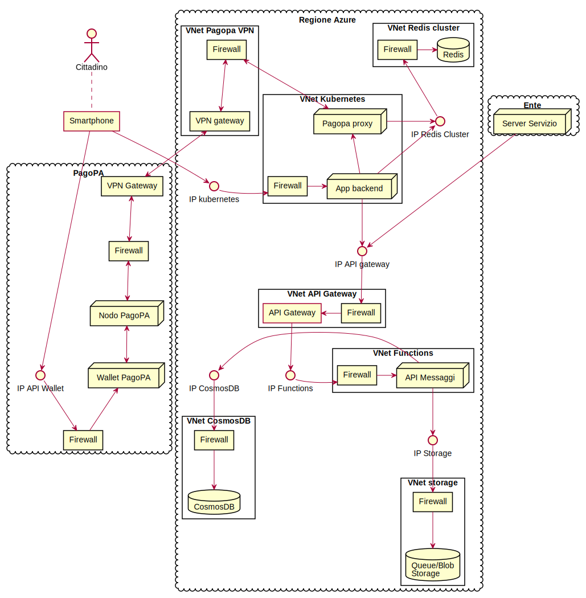

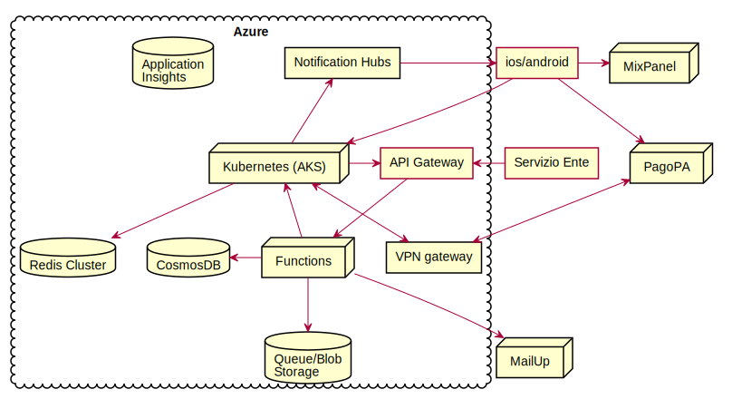

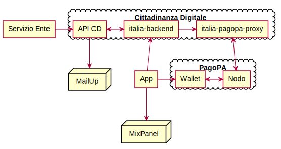

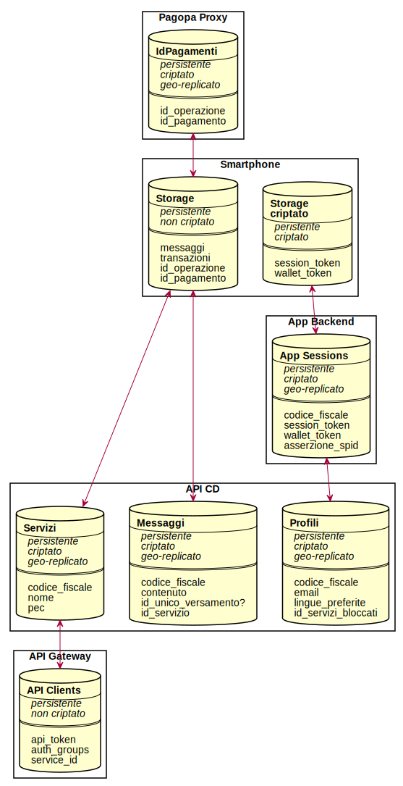
